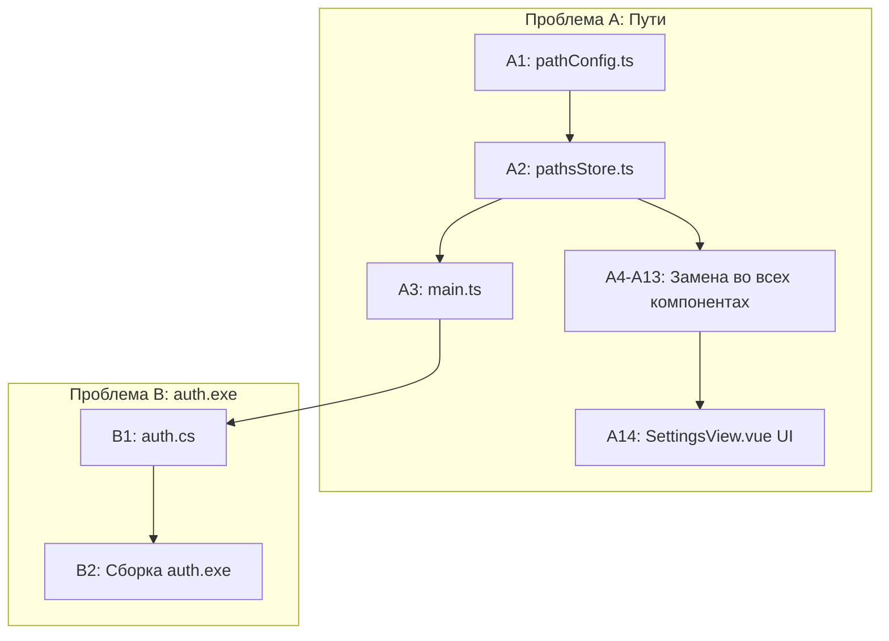

# План исправления: AppConfig race condition + auth.exe UNC/кодировка

## 1. Диагноз проблем

### Проблема A: Race condition — `appConfig.paths` вызывается до загрузки config.json

**Корневая причина:**

В [`main.ts`](frontend/src/main.ts:26-33) сначала монтируется Vue-приложение, потом асинхронно вызывается `appConfig.load()`. Но модули обращаются к `appConfig.paths` **на этапе инициализации** — до завершения `load()`:

| Файл                                                                                         | Строка                                    | Когда выполняется            |
| -------------------------------------------------------------------------------------------- | ----------------------------------------- | ---------------------------- |
| [`docxProcessor.ts`](frontend/src/assets/docxProcessor.ts:199-204)                           | Module-level CONFIG с `appConfig.paths.*` | При импорте                  |
| [`printPassports.vue`](frontend/src/components/printPassports.vue:16-18)                     | Module-level CONFIG с `appConfig.paths.*` | При импорте                  |
| [`ProductAssembly.vue`](frontend/src/components/views/ProductAssembly.vue:57-59)             | `OK_PATH = appConfig.paths.*`             | В `setup()`                  |
| [`ProductFunctionalTest.vue`](frontend/src/components/views/ProductFunctionalTest.vue:28-30) | `OK_PATH = appConfig.paths.*`             | В `setup()`                  |
| [`ProductMarking.vue`](frontend/src/components/views/ProductMarking.vue:21)                  | `OK_PATH = appConfig.paths.*`             | В `setup()`                  |
| [`InputControl.vue`](frontend/src/components/views/InputControl.vue:23)                      | `OK_PATH = appConfig.paths.*`             | В `setup()`                  |
| [`PreProduction.vue`](frontend/src/components/views/PreProduction.vue:35)                    | `OK_PATH = appConfig.paths.*`             | В `setup()`                  |
| [`DevView.vue`](frontend/src/components/views/DevView.vue:194-201)                           | `appConfig.paths.kd`                      | В `setup()`                  |
| [`AddArticle.vue`](frontend/src/components/views/AddArticle.vue:206)                         | `appConfig.paths.ok`                      | Внутри функции (НЕ проблема) |

Геттер в [`AppConfig.ts:110-116`](frontend/src/assets/utils/AppConfig.ts:110) возвращает `DEFAULT_PATHS` если `data === null`. Компоненты получают дефолты, а когда `load()` завершается — они уже проинициализированы.

### Проблема B: auth.exe — кракозябры + CMD.EXE UNC

**Корневая причина:**

1. **CMD.EXE не может работать с UNC** — если TAU.exe запущен с сетевой папки (`\\server\...\TAU.exe`), дочерний процесс `auth.exe` наследует Working Directory на UNC-пути. `auth.cs` устанавливает WorkingDirectory для `net use` (строка 44), но НЕ для самого процесса.
2. **Кракозябры** — `auth.cs` (строка 79) использует `Encoding.UTF8`, но NeutralinoJS может читать вывод в OEM (CP866). Несовпадение кодировок.

---

## 2. Решение Проблемы A: Переход на локальное хранение путей (как authConfig)

### Новая архитектура (по аналогии с authConfig)

Сейчас `authConfig.ts` хранит настройки авторизации локально в `.tmp/authConfig.json` и загружается через `userStore.initAuth()`. Сделаем то же самое для путей.

```
Текущая архитектура (сломанная):
  config.json (корень) → AppConfig.load() → appConfig.paths
                                              ↓ (race condition)
                                     Компоненты читают ДО load()

Предлагаемая архитектура:
  config.json (корень, мастер-копия)
       ↓ (первичная загрузка)
  .tmp/pathsConfig.json (локальная копия)
       ↓
  pathsStore (Pinia, reactive)
       ↓
  Компоненты ← pathsStore.paths (реактивно)
       ↓
  SettingsView.vue (редактирование)
       ↓ (сохранение)
  .tmp/pathsConfig.json + config.json (синхронизация)
```

### Шаг A1: Создать `pathConfig.ts` (аналог `authConfig.ts`)

```typescript
// frontend/src/assets/utils/pathConfig.ts
import { filesystem } from "@neutralinojs/lib";

export interface AppPaths {
  ok: string;
  okPdf: string;
  kd: string;
  passports: string;
  marking: string;
  other: string;
  convertFolder: string;
  resourcesPath: string;
}

// Дефолтные значения (из текущего config.json)
const DEFAULT_PATHS: AppPaths = {
  ok: "//rucekaspinffs05.metran.local/Dept-MP/Production/Internal/Продукты/ТАУ/Операционные карты",
  okPdf:
    "//rucekaspinffs05.metran.local/Dept-MP/Production/Internal/Продукты/ТАУ/Операционные карты/ОК PDF",
  kd: "//rucekaspinffs05.metran.local/Dept-MP/Production/Internal/Продукты/ТАУ/КД",
  passports:
    "//rucekaspinffs05.metran.local/Dept-MP/Production/Internal/Продукты/ТАУ/Паспорта",
  marking:
    "//rucekaspinffs05.metran.local/Dept-MP/Production/Internal/Продукты/ТАУ/Наклейки/Гравировка",
  other:
    "//rucekaspinffs05.metran.local/Dept-MP/Production/Internal/Продукты/ТАУ/Софт/прикладные документы",
  convertFolder: "./convertFolder",
  resourcesPath: "/frontend/dist/",
};

function getConfigPath(): string {
  return `${window.NL_PATH}/.tmp/pathsConfig.json`;
}

export async function loadPathsConfig(): Promise<AppPaths> {
  try {
    // 1. Пробуем прочитать локальную копию
    const content = await filesystem.readFile(getConfigPath());
    return JSON.parse(content) as AppPaths;
  } catch {
    // 2. Если нет локальной — читаем мастер config.json
    try {
      const raw = await filesystem.readFile("./config.json");
      const parsed = JSON.parse(raw);
      if (parsed.paths) {
        const merged: AppPaths = { ...DEFAULT_PATHS, ...parsed.paths };
        // Сохраняем локальную копию
        await savePathsConfig(merged);
        return merged;
      }
    } catch {
      /* fallback */
    }
    // 3. Если ничего нет — дефолты
    return { ...DEFAULT_PATHS };
  }
}

export async function savePathsConfig(paths: AppPaths): Promise<void> {
  await filesystem.writeFile(getConfigPath(), JSON.stringify(paths, null, 2));
}
```

### Шаг A2: Создать `pathsStore.ts` (Pinia store)

```typescript
// frontend/src/stores/paths.ts
import { defineStore } from "pinia";
import { ref } from "vue";
import {
  loadPathsConfig,
  savePathsConfig,
  type AppPaths,
} from "@/assets/utils/pathConfig";

const DEFAULT_PATHS: AppPaths = {
  /* ... */
};

export const usePathsStore = defineStore("paths", () => {
  const paths = ref<AppPaths>({ ...DEFAULT_PATHS });
  const loaded = ref(false);

  async function loadPaths(): Promise<void> {
    if (loaded.value) return;
    paths.value = await loadPathsConfig();
    loaded.value = true;
  }

  async function updatePath<K extends keyof AppPaths>(
    key: K,
    value: string,
  ): Promise<void> {
    paths.value[key] = value;
    await savePathsConfig(paths.value);
  }

  async function resetToDefaults(): Promise<void> {
    paths.value = { ...DEFAULT_PATHS };
    await savePathsConfig(paths.value);
  }

  return { paths, loaded, loadPaths, updatePath, resetToDefaults };
});
```

### Шаг A3: Изменить `main.ts` — загружать pathsStore до монтирования

```typescript
// main.ts
import { usePathsStore } from "./stores/paths";

const pathsStore = usePathsStore();

pathsStore.loadPaths().then(() => {
  const app = createApp(App).use(router).use(createPinia()).use(vuetify);
  app.mount("#app");

  // После монтирования — инициализация авторизации
  userStore.initAuth().then(() => {
    if (userStore.isAuthorized) wsStore.connect();
  });
});
```

### Шаг A4: Заменить `appConfig.paths` на `pathsStore.paths` во всех компонентах

**Принцип замены:**

| Было                                                   | Стало                                            |
| ------------------------------------------------------ | ------------------------------------------------ |
| `import { appConfig } from '@/assets/utils/AppConfig'` | `import { usePathsStore } from '@/stores/paths'` |
| `appConfig.paths.ok`                                   | `pathsStore.paths.ok`                            |
| `appConfig.paths.okPdf`                                | `pathsStore.paths.okPdf`                         |
| `appConfig.paths.kd`                                   | `pathsStore.paths.kd`                            |
| `appConfig.paths.passports`                            | `pathsStore.paths.passports`                     |
| `appConfig.paths.marking`                              | `pathsStore.paths.marking`                       |
| `appConfig.paths.other`                                | `pathsStore.paths.other`                         |
| `appConfig.paths.convertFolder`                        | `pathsStore.paths.convertFolder`                 |
| `appConfig.paths.resourcesPath`                        | `pathsStore.paths.resourcesPath`                 |

**Конкретные файлы:**

- [`docxProcessor.ts`](frontend/src/assets/docxProcessor.ts:197-204) — заменить module-level CONFIG на store + lazy init
- [`printPassports.vue`](frontend/src/components/printPassports.vue:11-18) — заменить CONFIG
- [`ProductAssembly.vue`](frontend/src/components/views/ProductAssembly.vue:32,57-59,268,274,366-367,375,443,514,782,829) — 12 мест
- [`_ProductAssembly.vue`](frontend/src/components/views/_ProductAssembly.vue:19,317,322,489) — 4 места
- [`ProductFunctionalTest.vue`](frontend/src/components/views/ProductFunctionalTest.vue:26,28-30) — 3 места
- [`ProductMarking.vue`](frontend/src/components/views/ProductMarking.vue:7,21,217) — 3 места
- [`InputControl.vue`](frontend/src/components/views/InputControl.vue:10,23) — 2 места
- [`PreProduction.vue`](frontend/src/components/views/PreProduction.vue:3,35,349) — 3 места
- [`DevView.vue`](frontend/src/components/views/DevView.vue:8,195,201) — 3 места
- [`AddArticle.vue`](frontend/src/components/views/AddArticle.vue:3,206) — 2 места

### Шаг A5: Добавить UI для редактирования путей в `SettingsView.vue`

Добавить секцию "Сетевые пути" с полями для каждого пути:

```vue
<v-card variant="outlined" class="pa-4 mb-4">
  <v-card-title class="text-h6 pa-0 mb-2">Сетевые пути</v-card-title>
  <v-card-text class="pa-0">
    <v-text-field
      v-for="(label, key) in pathLabels"
      :key="key"
      :label="label"
      :model-value="pathsStore.paths[key as keyof AppPaths]"
      @update:model-value="v => pathsStore.updatePath(key as keyof AppPaths, v)"
      hide-details
      class="mb-2"
    />
    <v-btn variant="text" color="warning" @click="pathsStore.resetToDefaults()">
      Сбросить на умолчания
    </v-btn>
  </v-card-text>
</v-card>
```

### Шаг A6: Опционально — удалить/депрекейтнуть старый `AppConfig.ts`

После полной замены `AppConfig` можно удалить, а `config.json` в корне оставить как мастер-копию (источник дефолтов при первом запуске).

---

## 3. Решение Проблемы B: auth.exe — UNC + кодировка

### Шаг B1: Установить Working Directory в `auth.cs`

[`auth.cs:77-82`](frontend/public/auth.cs:77) — добавить в начало `Main()`:

```csharp
static void Main()
{
    // Принудительно устанавливаем Working Directory на SystemRoot,
    // чтобы избежать ошибки "CMD.EXE не может работать с UNC"
    Environment.CurrentDirectory = Environment.GetEnvironmentVariable("SystemRoot")
        ?? @"C:\Windows";

    Console.OutputEncoding = Encoding.UTF8;
    // ...
}
```

### Шаг B2: Исправить кодировку вывода

В [`auth.cs:79-80`](frontend/public/auth.cs:79):

```csharp
Console.OutputEncoding = Encoding.UTF8;
Console.InputEncoding = Encoding.UTF8; // добавить
```

### Шаг B3: Пересобрать `auth.exe`

Скомпилировать обновлённый `auth.cs` в `auth.exe`:

```powershell
csc.exe /target:exe /out:frontend/public/auth.exe frontend/public/auth.cs
```

---

## 4. Итоговый чеклист

### Проблема A: Новые файлы

- [ ] **A1**: Создать [`frontend/src/assets/utils/pathConfig.ts`](frontend/src/assets/utils/pathConfig.ts) — load/save paths локально
- [ ] **A2**: Создать [`frontend/src/stores/paths.ts`](frontend/src/stores/paths.ts) — Pinia store

### Проблема A: Изменяемые файлы

- [ ] **A3**: [`frontend/src/main.ts`](frontend/src/main.ts) — pathsStore.loadPaths() до mount()
- [ ] **A4**: [`frontend/src/assets/docxProcessor.ts`](frontend/src/assets/docxProcessor.ts) — замена CONFIG
- [ ] **A5**: [`frontend/src/components/printPassports.vue`](frontend/src/components/printPassports.vue) — замена CONFIG
- [ ] **A6**: [`frontend/src/components/views/ProductAssembly.vue`](frontend/src/components/views/ProductAssembly.vue) — 12 замен
- [ ] **A7**: [`frontend/src/components/views/_ProductAssembly.vue`](frontend/src/components/views/_ProductAssembly.vue) — 4 замены
- [ ] **A8**: [`frontend/src/components/views/ProductFunctionalTest.vue`](frontend/src/components/views/ProductFunctionalTest.vue) — 3 замены
- [ ] **A9**: [`frontend/src/components/views/ProductMarking.vue`](frontend/src/components/views/ProductMarking.vue) — 3 замены
- [ ] **A10**: [`frontend/src/components/views/InputControl.vue`](frontend/src/components/views/InputControl.vue) — 2 замены
- [ ] **A11**: [`frontend/src/components/views/PreProduction.vue`](frontend/src/components/views/PreProduction.vue) — 3 замены
- [ ] **A12**: [`frontend/src/components/views/DevView.vue`](frontend/src/components/views/DevView.vue) — 3 замены
- [ ] **A13**: [`frontend/src/components/views/AddArticle.vue`](frontend/src/components/views/AddArticle.vue) — 2 замены
- [ ] **A14**: [`frontend/src/components/views/SettingsView.vue`](frontend/src/components/views/SettingsView.vue) — UI для путей

### Проблема B

- [ ] **B1**: [`frontend/public/auth.cs`](frontend/public/auth.cs) — добавить Environment.CurrentDirectory
- [ ] **B2**: Пересобрать `auth.exe`
- [ ] **B3**: [`frontend/src/assets/utils/authWin.ts`](frontend/src/assets/utils/authWin.ts) — fallback-декодирование (опционально)

### Порядок выполнения



### Риски

1. **Замена во всех компонентах** — много файлов, можно пропустить. Нужно проверить через search.
2. **Сборка auth.exe** — требуется C# compiler. Можно попробовать `csc` из .NET Framework или `dotnet build`.
3. **Совместимость** — `pathsStore.paths` должно быть доступно синхронно (ref), так как компоненты читают его в `setup()`.
