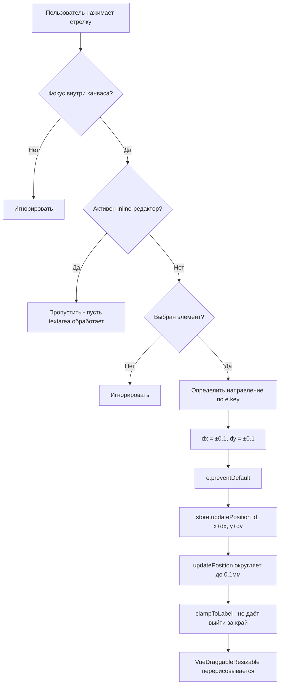

# План: Перемещение блоков стрелками на 0.1 мм

## Задача

В редакторе этикеток ([`LabelCanvas.vue`](frontend/src/components/label-editor/LabelCanvas.vue)) при выборе блока нужно слушать нажатие стрелок ↑↓←→ и перемещать позицию блока на 0.1 мм в соответствующую сторону.

---

## Анализ текущей реализации

### Система координат и единицы

- Все позиции хранятся в **миллиметрах** в сторе [`labelEditor.ts`](frontend/src/stores/labelEditor.ts) (поле `positions: Record<string, ElementPosition>`).
- Тип [`ElementPosition`](frontend/src/types/label.ts:7) содержит `x`, `y` (от верхнего левого угла этикетки), `w`, `h` — все в мм.
- Конвертация в пиксели для отрисовки: [`mmToPx()`](frontend/src/components/label-editor/LabelCanvas.vue:90) умножает на `MM_TO_PX (3.78) * zoom`.
- Шаг привязки сетки (snap) — `0.1 мм` (константа [`SNAP_MM`](frontend/src/components/label-editor/LabelCanvas.vue:35)).
- Функция [`store.updatePosition()`](frontend/src/stores/labelEditor.ts:219) округляет все значения до 0.1 мм и клиппирует (`clampToLabel`), чтобы элемент не выходил за границы этикетки.

### Существующая обработка клавиш

- В компоненте есть inline-редактор текста ([`editingId`](frontend/src/components/label-editor/LabelCanvas.vue:110)), который обрабатывает `Esc`, `Ctrl+Enter` через `@keydown` на `<textarea>`.
- Колёсико мыши обрабатывается через [`@wheel.prevent`](frontend/src/components/label-editor/LabelCanvas.vue:237) на `.canvas-container`.
- Обработки стрелок **нет**.

### Механизм выбора блока

- При клике на `VueDraggableResizable` срабатывает [`@activated="selectedId = String(id)"`](frontend/src/components/label-editor/LabelCanvas.vue:271).
- При клике на пустое место — [`@click.self="onCanvasClick"`](frontend/src/components/label-editor/LabelCanvas.vue:249), который сбрасывает `selectedId`.

---

## План реализации

### 1. Добавить обработчик `keydown` в `LabelCanvas.vue`

**Где:** В секции `<script setup>`.

**Подход:** Использовать `document.addEventListener('keydown', handler)` в `onMounted` с удалением в `onUnmounted`. Это надёжнее, чем `@keydown` на контейнере, поскольку:

- Фокус может быть на `VueDraggableResizable` или других элементах внутри канваса.
- Не требует управления `tabindex` и программного фокуса.
- Легко проверить, находится ли цель события внутри канваса.

### 2. Логика обработчика

```ts
function onArrowKey(e: KeyboardEvent) {
  // 1. Проверка: событие должно быть в пределах канваса
  if (!containerEl.value?.contains(e.target as Node)) return;

  // 2. Если активен inline-редактор — не перехватываем (пусть текстarea работает)
  if (editingId.value) return;

  // 3. Если активна кисточка или связь — не перехватываем
  if (copyBrushActive.value || linkBrushActive.value) return;

  // 4. Нет выбранного элемента — игнорируем
  if (!selectedId.value) return;

  const pos = positions.value[selectedId.value];
  if (!pos) return;

  let dx = 0,
    dy = 0;
  switch (e.key) {
    case "ArrowUp":
      dy = -0.1;
      break;
    case "ArrowDown":
      dy = 0.1;
      break;
    case "ArrowLeft":
      dx = -0.1;
      break;
    case "ArrowRight":
      dx = 0.1;
      break;
    default:
      return; // не стрелка
  }

  e.preventDefault(); // предотвращаем скролл страницы

  store.updatePosition(selectedId.value, {
    x: pos.x + dx,
    y: pos.y + dy,
    w: pos.w,
    h: pos.h,
  });
}
```

**Важно:** Функция [`updatePosition`](frontend/src/stores/labelEditor.ts:219) сама округлит до 0.1 мм и применит `clampToLabel` — элемент не выйдет за границы этикетки.

### 3. Подписка на события

```ts
onMounted(() => document.addEventListener("keydown", onArrowKey));
onUnmounted(() => document.removeEventListener("keydown", onArrowKey));
```

### 4. Изменения в шаблоне (опционально)

Визуально никаких изменений не требуется. Можно добавить подсказку в `.zoom-hint` о возможности перемещения стрелками, но это не обязательно и может быть сделано отдельно.

---

## Файлы для изменений

| Файл                                                                      | Изменения                                                               |
| ------------------------------------------------------------------------- | ----------------------------------------------------------------------- |
| [`LabelCanvas.vue`](frontend/src/components/label-editor/LabelCanvas.vue) | Добавить функцию `onArrowKey`, подписку через `onMounted`/`onUnmounted` |
| [`labelEditor.ts`](frontend/src/stores/labelEditor.ts)                    | **Не требует изменений** — `updatePosition` уже делает всё необходимое  |

---

## Потенциальные конфликты

1. **Inline-редактирование текста:** Если пользователь редактирует текст внутри `<textarea>` и нажимает стрелки (для навигации по тексту), обработчик корректно пропустит событие благодаря проверке `editingId.value`.

2. **Copy Brush / Link Brush:** При активной кисточке стрелки не будут двигать блок — это правильно, чтобы не сбить пользователя.

3. **Скролл страницы:** `e.preventDefault()` предотвращает прокрутку при нажатии стрелок, когда фокус на канвасе.

4. **VueDraggableResizable:** Компонент может сам обрабатывать стрелки для перемещения. Проверка: если VDR перехватывает событие раньше (`@keydown` на нём), то `document.addEventListener` может не сработать. Нужно удостовериться, что VDR **не** обрабатывает стрелки (по умолчанию не должен, он обрабатывает только drag/resize мышью).

---

## Диаграмма потока



---

## Итоговый список задач для реализации

1. В [`LabelCanvas.vue`](frontend/src/components/label-editor/LabelCanvas.vue) добавить функцию `onArrowKey` с логикой из п.2 плана.
2. Добавить вызовы `document.addEventListener('keydown', onArrowKey)` в `onMounted` и `removeEventListener` в `onUnmounted`.
3. Проверить, что `VueDraggableResizable` не перехватывает стрелки (если перехватывает — добавить `@keydown.prevent` или модификатор).
