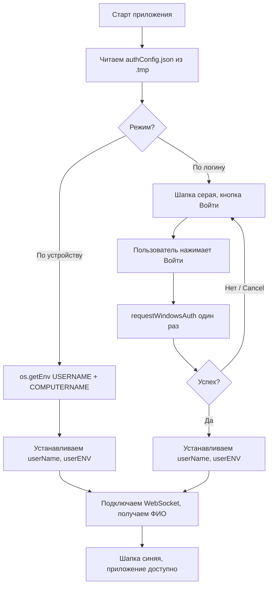
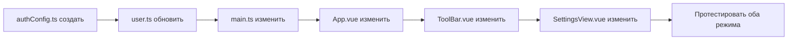

# План рефакторинга авторизации (v2)

## Текущая проблема

Два вложенных бесконечных цикла:

1. **`frontend/public/auth.cs:50`** — `while (true)` — при Cancel возвращает `CANCELED`
2. **`frontend/src/stores/user.ts:51`** — `while (!login)` — при `null` снова вызывает окно

**Итог:** Cancel → бесконечная череда окон Windows Security.

## Требования (уточнённые)

### Два режима авторизации (настройка в SettingsView)

| Режим             | Описание                                                                                                                                                                                                                                                                                                                        | Хранение                                       |
| ----------------- | ------------------------------------------------------------------------------------------------------------------------------------------------------------------------------------------------------------------------------------------------------------------------------------------------------------------------------- | ---------------------------------------------- |
| **По устройству** | Автоматически берём `USERNAME` + `COMPUTERNAME` из env при старте. Пользователь считается авторизованным.                                                                                                                                                                                                                       | Настройка сохраняется в `.tmp/authConfig.json` |
| **По логину**     | При старте приложение не авторизовано. В тулбаре: серый фон, кнопка «Войти». При клике — окно Windows Security. Внутри окна штатный цикл Windows (неверный пароль → повторить). При Cancel — окно закрывается, приложение остаётся неавторизованным. При успехе — синий фон, подключается WebSocket. Действует в рамках сессии. | Настройка сохраняется в `.tmp/authConfig.json` |

### Поток при запуске



---

## Детальный план изменений

### Шаг 1: Хранение настроек авторизации

**Новый файл:** `frontend/src/assets/utils/authConfig.ts`

```ts
import { filesystem } from "@neutralinojs/lib";

export type AuthMode = "device" | "login";

export interface AuthConfig {
  mode: AuthMode;
}

const CONFIG_PATH = `${window.NL_PATH}/.tmp/authConfig.json`;

export async function loadAuthConfig(): Promise<AuthConfig> {
  try {
    const content = await filesystem.readFile(CONFIG_PATH);
    return JSON.parse(content) as AuthConfig;
  } catch {
    // По умолчанию — авторизация по устройству
    return { mode: "device" };
  }
}

export async function saveAuthConfig(config: AuthConfig): Promise<void> {
  await filesystem.writeFile(CONFIG_PATH, JSON.stringify(config, null, 2));
}
```

---

### Шаг 2: Обновить `user.ts` (store)

**Файл:** `frontend/src/stores/user.ts`

#### Добавить в state:

- `authMode: AuthMode` — текущий режим (загружается из конфига)

#### Добавить геттер:

- `isAuthorized`: возвращает `!!this.userName`

#### Переписать метод `getAuth()`:

```ts
async getAuth(): Promise<boolean> {
  this.isLoadingUser = true
  try {
    this.isSystemAuthOpen = true
    const login = await requestWindowsAuth()
    this.isSystemAuthOpen = false

    if (!login) {
      // Пользователь отменил — не авторизован
      this.isLoadingUser = false
      return false
    }

    this.userName = login
    await this.getUserENV()
    await this.getUserName()
    this.isLoadingUser = false
    return true
  } catch (err) {
    console.error('Ошибка при авторизации', err)
    this.isSystemAuthOpen = false
    this.isLoadingUser = false
    return false
  }
}
```

#### Новый метод `initAuth()`:

```ts
async initAuth(): Promise<void> {
  const config = await loadAuthConfig()
  this.authMode = config.mode

  if (config.mode === 'device') {
    // Авторизация по устройству — берём из env
    const username = await os.getEnv('USERNAME')
    const computername = await os.getEnv('COMPUTERNAME')
    this.userName = username
    this.userENV = `${username}_${computername}`
    await this.getUserName() // получение ФИО из БД
    // Подключение WebSocket будет вызвано отдельно
  }
  // Если 'login' — ничего не делаем, ждём кнопку
}
```

#### Новый метод `setAuthMode(mode: AuthMode)`:

```ts
async setAuthMode(mode: AuthMode): Promise<void> {
  this.authMode = mode
  await saveAuthConfig({ mode })

  if (mode === 'device') {
    // Сразу авторизуем
    await this.initAuth()
  } else {
    // Сбрасываем авторизацию
    this.userName = ''
    this.userENV = ''
    this.userFullName = ''
    this.userExist = true
  }
}
```

---

### Шаг 3: Изменить `main.ts`

**Файл:** `frontend/src/main.ts`

Убрать прямые вызовы `getAuth()`. Вместо этого:

```ts
userStore.initAuth().then(() => {
  if (userStore.isAuthorized) {
    userStore.getUserENV().then(() => {
      wsStore.connect();
      userStore.getUserName();
    });
  }
});
```

Если `initAuth()` авторизовала (режим device), подключаем всё. Если нет (режим login) — ничего не делаем, ждём кнопку.

---

### Шаг 4: Изменить `App.vue`

**Файл:** `frontend/src/App.vue`

#### Добавить:

- Кнопку/иконку входа, когда `!userStore.isAuthorized && userStore.authMode === 'login'`
- По клику вызывает `userStore.getAuth()` и при успехе подключает WebSocket
- Условный стиль/текст для неавторизованного состояния

#### Убрать/изменить:

- Блокирующий overlay `v-dialog` для `isSystemAuthOpen` — оставить как спиннер на время открытия окна, но не блокировать навечно

```vue
<template>
  <div>
    <ErrorComponent />

    <!-- Если не авторизован и режим login -->
    <v-app-bar
      v-if="!userStore.isAuthorized && userStore.authMode === 'login'"
      density="compact"
      color="grey"
      elevation="2"
    >
      <v-app-bar-title> ТАУ — необходима авторизация </v-app-bar-title>
      <v-btn variant="text" @click="handleLogin">
        <v-icon start>mdi-login</v-icon>
        Войти
      </v-btn>
    </v-app-bar>

    <RouterView />

    <!-- Спиннер при открытом окне авторизации -->
    <v-dialog v-model="userStore.isSystemAuthOpen" max-width="500px" persistent>
      <v-card
        class="d-flex flex-column align-center justify-center pa-6"
        color="background"
        style="background: rgba(15, 15, 21, 0.85); backdrop-filter: blur(10px)"
      >
        <v-progress-circular
          indeterminate
          color="primary"
          size="64"
          class="mb-4"
        />
        <h2 class="text-h5">Подтверждение доступа</h2>
        <p class="text-body-2 text-grey">
          Подтвердите учётную запись в окне Windows Безопасность
        </p>
      </v-card>
    </v-dialog>

    <!-- Диалог ввода ФИО (без изменений) -->
    <v-dialog v-model="showUserDialog" max-width="500px" persistent
      >...</v-dialog
    >
  </div>
</template>
```

#### Новый метод `handleLogin()`:

```ts
async function handleLogin() {
  const success = await userStore.getAuth();
  if (success) {
    userStore.getUserENV();
    wsStore.connect();
  }
}
```

---

### Шаг 5: Изменить `ToolBar.vue` — динамический цвет шапки

**Файл:** `frontend/src/components/ToolBar.vue`

Когда авторизация по логину и пользователь не авторизован — цвет шапки серый.
После авторизации — синий (`primary`).

```ts
const bgColor = computed(() => {
  if (import.meta.env.MODE === "development") return "red";
  if (userStore.authMode === "login" && !userStore.isAuthorized) return "grey";
  return "primary";
});
```

---

### Шаг 6: Изменить `SettingsView.vue` — настройка типа авторизации

**Файл:** `frontend/src/components/views/SettingsView.vue`

Добавить переключатель:

```vue
<v-radio-group v-model="authMode" @update:model-value="onAuthModeChange">
  <v-radio label="Авторизация по устройству" value="device" />
  <v-radio label="Авторизация по логину" value="login" />
</v-radio-group>
```

При смене вызывать `userStore.setAuthMode(newMode)`.

---

### Шаг 7: Настроить WebSocket подключение

**Файл:** `frontend/src/stores/websockets.ts` — без изменений в логике.
**Файл:** `frontend/src/main.ts` — подключать WebSocket **только после успешной авторизации**.

---

### Шаг 8: auth.cs — оставить как есть

**Файл:** `frontend/public/auth.cs` — НЕ меняем. Цикл `while (true)` внутри auth.cs — это **штатное поведение Windows**: при неверном пароле окно просит ввести снова. Это нормально.

Главное — **внешний цикл** в `user.ts` убираем, и тогда при Cancel окно просто закрывается, приложение остаётся неавторизованным.

---

## Итоговый список изменений

| №   | Файл                                             | Действие                                                                                      |
| --- | ------------------------------------------------ | --------------------------------------------------------------------------------------------- |
| 1   | `frontend/src/assets/utils/authConfig.ts`        | **СОЗДАТЬ** — функции load/save конфига                                                       |
| 2   | `frontend/src/stores/user.ts`                    | **ИЗМЕНИТЬ** — добавить `initAuth()`, `setAuthMode()`, `isAuthorized`, переписать `getAuth()` |
| 3   | `frontend/src/main.ts`                           | **ИЗМЕНИТЬ** — убрать `getAuth()`, вызывать `initAuth()`                                      |
| 4   | `frontend/src/App.vue`                           | **ИЗМЕНИТЬ** — добавить панель/кнопку входа, условные стили                                   |
| 5   | `frontend/src/components/ToolBar.vue`            | **ИЗМЕНИТЬ** — динамический цвет (серый/primary)                                              |
| 6   | `frontend/src/components/views/SettingsView.vue` | **ИЗМЕНИТЬ** — добавить переключатель режима авторизации                                      |
| 7   | `frontend/src/stores/websockets.ts`              | **НЕ МЕНЯТЬ** (или минимально)                                                                |
| 8   | `frontend/public/auth.cs`                        | **НЕ МЕНЯТЬ** (штатное поведение Windows)                                                     |

## Последовательность выполнения


