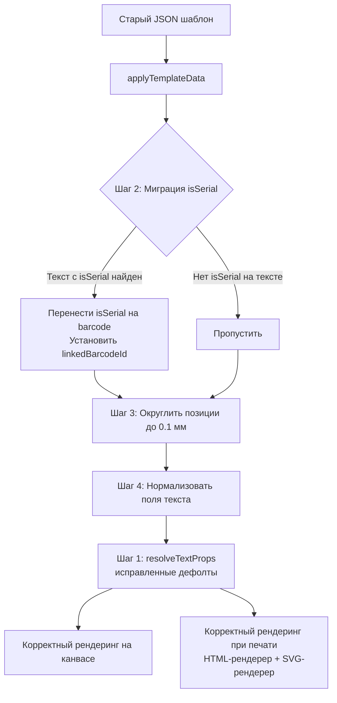

# План: Исправление обратной совместимости редактора этикеток

## Проблема

Старые шаблоны этикеток (пример в задаче) открываются «криво» — элементы отображаются с некорректными отступами, а `isSerial` на текстовых элементах теряется при повторном сохранении.

## Выявленные проблемы

### Проблема 1. `resolveTextProps` — неверный fallback для padding

**Файл:** [`frontend/src/types/label.ts:38-39`](frontend/src/types/label.ts:38)

```ts
const legacyPX = props.paddingX != null ? props.paddingX / _MM_TO_PX : 1.0; // ← 1.0 мм по умолчанию
const legacyPY = props.paddingY != null ? props.paddingY / _MM_TO_PX : 0.0;
```

Когда старый шаблон не содержит `paddingX` (поля не было в той версии редактора), `legacyPX` становится `1.0` мм. Это значение подставляется для отсутствующих `paddingRight`/`paddingLeft`:

```ts
paddingRight: props.paddingRight ?? legacyPX,  // = 1.0 мм (неверно!)
paddingLeft:  props.paddingLeft  ?? legacyPX,  // = 1.0 мм (для элементов без paddingLeft)
```

**Симптомы на конкретном шаблоне:**

| Элемент                                       | Ожидаемый padding | Фактический (сейчас) |
| --------------------------------------------- | ----------------- | -------------------- |
| `w4bwwes` (serial_1) — есть `paddingLeft:0.2` | L:0.2, R:0        | L:0.2, **R:1.0**     |
| `gcye44f` (manufacturer_1) — нет padding      | L:0, R:0          | **L:1.0, R:1.0**     |
| `lgdo0zn` (manufacturer_2) — нет padding      | L:0, R:0          | **L:1.0, R:1.0**     |

**Корень:** `resolveTextProps` не различает два случая:

1. Старый формат c `paddingX`/`paddingY` (px → мм миграция) — нужен fallback `1.0`
2. Старый/новый формат **без** `paddingX`/`paddingY` — missing paddings должны быть `0`

### Проблема 2. `isSerial` на текстовых элементах не мигрируется

Старый шаблон:

```json
"w4bwwes": { "type": "text", "dataField": "serial_1", "props": { "isSerial": true, ... } },
"srzw35x": { "type": "barcode", "dataField": "serial_barcode", "props": { "isSerial": false, ... } }
```

В текущем коде:

- [`hasSerialInTemplate`](frontend/src/stores/labelEditor.ts:134) — проверяет только `barcode` элементы
- [`buildTemplateData`](frontend/src/stores/labelEditor.ts:367-380) — не сохраняет `isSerial` для `text`
- `applyTemplateData` сохраняет `isSerial` в store через spread, но computed-свойства его не видят

**Последствия:** При пересохранении шаблона `isSerial` на тексте теряется. При пакетной печати серийный номер не подставляется.

### Проблема 3. Координаты Y отображаются неверно — блоки съезжают по высоте

По сообщению пользователя: X-координаты работают корректно, но блоки отображаются на неправильных Y-позициях, некоторые даже за пределами этикетки. Причины из статического анализа кода не очевидны — `posToPx` использует одинаковую формулу для X и Y (`Math.round(mm * MM_TO_PX * zoom)`), и positions загружаются как есть.

**Гипотезы для runtime-исследования:**

- Проблема в `VueDraggableResizable` и интерпретации `:parent="true"` при изменении `zoom` или `labelSize`
- Конфликт реактивности: `zoom` обновляется асинхронно через `nextTick(fitZoom)` после загрузки шаблона, а первый рендер происходит со старым zoom
- Контейнер `.canvas-label` имеет `position: relative`, но `VueDraggableResizable` может некорректно определить родителя при ремаунте
- Проблема с `:key` на `VueDraggableResizable` — при смене ключа компонент пересоздаётся с переданными `:x/:y`, но может схлопываться до `min-height`/`min-width` если родитель ещё не отрисовался

**План диагностики в runtime:**

1. В `LabelCanvas.vue` добавить `console.log` в `posToPx` для отслеживания входных значений позиций и zoom
2. Проверить актуальные значения `positions` в store после загрузки шаблона
3. Проверить последовательность: `labelSize` → `positions` → `elements` → `templateKey++` → `fitZoom` async
4. Если причина найдена — исправить

### Проблема 4. Позиции с высокой точностью не округляются при загрузке

Старый шаблон:

```json
"rfmkcue": { "x": 23.280423280423282, "y": 0.4850088183421517, "w": 6.3051146384479715, "h": 5.8201058201058204 }
```

- [`applyTemplateData`](frontend/src/stores/labelEditor.ts:405) просто присваивает `positions.value = parsed.positions` без округления до 0.1 мм
- Это не ломает рендеринг (там `Math.round`), но при повторном открытии панели свойств значения отображаются с избыточной точностью

### Проблема 5. Отсутствие `verticalAlign`/`lineHeight` в старых шаблонах

У элементов `w4bwwes`, `5mwirpe`, `gcye44f`, `lgdo0zn` в старом шаблоне нет `verticalAlign` и `lineHeight`.

- [`resolveTextProps`](frontend/src/types/label.ts:46) даёт дефолты: `verticalAlign: 'middle'`, `lineHeight: 1.2`
- Если старый рендерер использовал `verticalAlign: 'top'` (без явного указания), это изменит визуальное отображение

## План исправлений

### Шаг 1. Исправить `resolveTextProps` — корректные дефолты padding

**Файл:** [`frontend/src/types/label.ts:36-52`](frontend/src/types/label.ts:36)

Изменить логику fallback:

```ts
export function resolveTextProps(props: LabelElementProps): TextRenderProps {
  // paddingX/paddingY — старый формат (значения в px)
  // Если paddingX задан — применяем миграцию px→мм
  // Если paddingX НЕ задан — missing paddings = 0
  const hasLegacyPx = props.paddingX != null || props.paddingY != null;

  let legacyPX = 0;
  let legacyPY = 0;
  if (hasLegacyPx) {
    legacyPX = props.paddingX != null ? props.paddingX / _MM_TO_PX : 0;
    legacyPY = props.paddingY != null ? props.paddingY / _MM_TO_PX : 0;
  }

  return {
    fontSize: props.fontSize ?? 12,
    fontFamily: props.fontFamily ?? "Arial",
    bold: props.bold ?? false,
    align: props.align ?? "left",
    verticalAlign: props.verticalAlign ?? "middle",
    lineHeight: props.lineHeight ?? 1.2,
    paddingTop: props.paddingTop ?? legacyPY,
    paddingRight: props.paddingRight ?? legacyPX,
    paddingBottom: props.paddingBottom ?? legacyPY,
    paddingLeft: props.paddingLeft ?? legacyPX,
  };
}
```

Эффект:

- Элементы с `paddingLeft:0.2` и без `paddingX` → L:0.2, R:0 (симметрично/0)
- Элементы без каких-либо padding → все 0
- Элементы со старым `paddingX: 3.78` (в px) → legacyPX = 1.0 мм (как и было)

### Шаг 2. Миграция `isSerial` с текста на barcode в `applyTemplateData`

**Файл:** [`frontend/src/stores/labelEditor.ts:422-439`](frontend/src/stores/labelEditor.ts:422)

При загрузке старого шаблона:

1. Обнаружить текстовые элементы с `isSerial === true`
2. Найти barcode-элемент с подходящим dataField (по префиксу или по наличию в шаблоне)
3. Установить `isSerial: true` на найденный barcode
4. Установить `linkedBarcodeId` на тексте, указывающий на barcode
5. Удалить `isSerial` из props текста

**Эвристика поиска barcode:** если есть barcode, чей `dataField` содержит `'barcode'` и префикс совпадает с префиксом dataField текста (`serial_1` ↔ `serial_barcode`). Если barcode не найден — просто игнорируем `isSerial` на тексте (логаем warning).

### Шаг 3. Диагностика и исправление Y-координат в runtime

**Файл:** [`frontend/src/components/label-editor/LabelCanvas.vue`](frontend/src/components/label-editor/LabelCanvas.vue)

1. Добавить отладочный `console.log` в `posToPx` — логировать `id`, `pos.y`, `zoom.value`, результат
2. Проверить в консоли браузера актуальные значения positions после загрузки шаблона
3. Проверить порядок срабатывания watcher'ов: `templateKey` → `nextTick(fitZoom)` — не рендерятся ли элементы с zoom=0.5 (initial) до того, как zoom пересчитается под размер 30×20мм
4. Если проблема в асинхронности `fitZoom` — синхронизировать: вызывать `fitZoom()` сразу внутри `applyTemplateData` после установки `labelSize`
5. Если проблема в `VueDraggableResizable` — возможно, нужно добавить ключ на родительский контейнер при смене templateKey

### Шаг 4. Округление позиций при загрузке

**Файл:** [`frontend/src/stores/labelEditor.ts:401-420`](frontend/src/stores/labelEditor.ts:401)

После присвоения `positions.value` прогнать все значения через `clampToLabel` или явное `Math.round(v * 10) / 10`, чтобы избавиться от избыточной точности.

### Шаг 5. Нормализация отсутствующих полей при загрузке

В [`applyTemplateData`](frontend/src/stores/labelEditor.ts:422-439), после создания элемента, для `text` элементов явно установить дефолты для отсутствующих полей:

```ts
if (el.type === "text") {
  // Нормализация: заполняем отсутствующие поля для единообразия
  const p = elements.value[id].props;
  if (p.verticalAlign == null) p.verticalAlign = "middle";
  if (p.lineHeight == null) p.lineHeight = 1.2;
  if (p.paddingTop == null) p.paddingTop = 0;
  if (p.paddingRight == null) p.paddingRight = 0;
  if (p.paddingBottom == null) p.paddingBottom = 0;
  if (p.paddingLeft == null) p.paddingLeft = 0;
}
```

Это гарантирует, что после загрузки шаблона все поля будут явно заданы, и повторное сохранение не потеряет их.

## Схема потока данных



## Файлы для изменений

| Файл                                                                       | Изменения                                                                                                     |
| -------------------------------------------------------------------------- | ------------------------------------------------------------------------------------------------------------- |
| [`frontend/src/types/label.ts`](frontend/src/types/label.ts)               | Исправить `resolveTextProps` — различать случай с legacy paddingX и без него                                  |
| [`frontend/src/stores/labelEditor.ts`](frontend/src/stores/labelEditor.ts) | В `applyTemplateData`: миграция `isSerial` с текста на barcode; округление позиций; нормализация полей текста |

## Тестирование

1. Открыть предоставленный старый шаблон — проверить что все элементы отображаются корректно (без асимметричных отступов)
2. Проверить что `isSerial` на тексте `serial_1` переносится на barcode `serial_barcode`
3. Сохранить шаблон — проверить что в сохранённом JSON нет `isSerial` на тексте, но есть `linkedBarcodeId` у текста и `isSerial: true` у barcode
4. Открыть сохранённый шаблон заново — проверить что всё отображается идентично
5. Проверить шаблоны созданные в новой версии редактора (с 4-сторонними padding) — они не должны сломаться (у них все поля явные, `paddingX` отсутствует → `hasLegacyPx = false`)
6. Проверить шаблоны со старым `paddingX`/`paddingY` в px — они должны корректно мигрироваться
