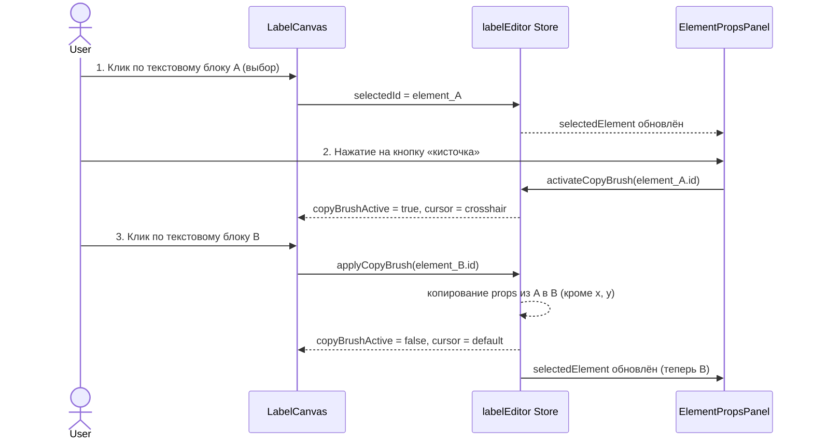

# План: Copy Brush — копирование настроек текстового блока

## Описание

Функция «кисточка» (paint roller / copy brush) для LabelEditor:  
пользователь выбирает **один текстовый блок** (источник), нажимает на иконку кисточки,  
затем кликает по **другому текстовому блоку** (цель) —  
все настройки из источника копируются в цель, **кроме позиции X, Y**.

## Пользовательский флоу (User Flow)



## Что копируется (для `type === 'text'`)

| Поле                           | Копируется? | Причина                                  |
| ------------------------------ | ----------- | ---------------------------------------- |
| `x`, `y`                       | **НЕТ**     | Явное требование пользователя            |
| `w`, `h`                       | **ДА**      | Размер блока — настройка, а не положение |
| `fontSize`                     | **ДА**      |                                          |
| `fontFamily`                   | **ДА**      |                                          |
| `bold`                         | **ДА**      |                                          |
| `align`                        | **ДА**      |                                          |
| `verticalAlign`                | **ДА**      |                                          |
| `lineHeight`                   | **ДА**      |                                          |
| `paddingTop/Right/Bottom/Left` | **ДА**      |                                          |
| `isSerial`                     | **НЕТ**     | Уникальное поле, одно на этикетку        |
| `dataField`                    | **НЕТ**     | Идентификатор поля, остаётся уникальным  |
| `customText`                   | **НЕТ**     | Содержимое текста остаётся своим         |

## Изменения в файлах

### 1. `frontend/src/stores/labelEditor.ts`

**Новое состояние (ref):**

- `copyBrushActive: ref(false)` — активен ли режим кисточки
- `copyBrushSourceId: ref<string | null>(null)` — ID элемента-источника

**Новые экшены:**

- `activateCopyBrush(id: string)` — устанавливает `copyBrushActive = true`, `copyBrushSourceId = id`
- `deactivateCopyBrush()` — сбрасывает оба ref в false/null
- `applyCopyBrush(targetId: string)` — берёт `props` из источника, копирует в цель (через глубокое клонирование), исключая позицию x, y

**Детали реализации `applyCopyBrush`:**

```ts
function applyCopyBrush(targetId: string): void {
  const srcId = copyBrushSourceId.value;
  if (!srcId || srcId === targetId) {
    deactivateCopyBrush();
    return;
  }
  const src = elements.value[srcId];
  const tgt = elements.value[targetId];
  if (!src || !tgt || src.type !== "text" || tgt.type !== "text") {
    deactivateCopyBrush();
    return;
  }

  // Копируем props (кроме isSerial, dataField, customText)
  const propsToCopy: (keyof LabelElementProps)[] = [
    "fontSize",
    "fontFamily",
    "bold",
    "align",
    "verticalAlign",
    "lineHeight",
    "paddingTop",
    "paddingRight",
    "paddingBottom",
    "paddingLeft",
  ];
  for (const key of propsToCopy) {
    (tgt.props as any)[key] = (src.props as any)[key];
  }

  // Копируем размеры w, h (но не x, y)
  const srcPos = positions.value[srcId];
  if (srcPos) {
    const tgtPos = positions.value[targetId];
    if (tgtPos) {
      store.updatePosition(targetId, {
        x: tgtPos.x,
        y: tgtPos.y,
        w: srcPos.w,
        h: srcPos.h,
      });
    }
  }

  deactivateCopyBrush();
  selectedId.value = targetId;
}
```

### 2. `frontend/src/components/label-editor/ElementPropsPanel.vue`

- **Добавить кнопку «кисточка»** в `rbn-type` рядом с уже существующими контролами для текста.
  - Использовать иконку `mdi-format-paint`
  - Показывать только когда выбран текстовый блок (`isText`)
  - В активном состоянии кнопка подсвечивается (`btn--on`)
  - При клике вызывает `store.activateCopyBrush(selectedId!)`

Примерный код для вставки после чипа (chip--text):

```html
<div class="sep" />
<v-tooltip text="Копировать настройки (кисточка)" location="bottom">
  <template #activator="{ props: tp }">
    <button
      v-bind="tp"
      :class="[
        'btn', 'btn--lbl',
        { 'btn--on': store.copyBrushActive }
      ]"
      @click="store.activateCopyBrush(selectedId!)"
    >
      <v-icon size="14">mdi-format-paint</v-icon><span>Кисточка</span>
    </button>
  </template>
</v-tooltip>
```

### 3. `frontend/src/components/label-editor/LabelCanvas.vue`

- **Добавить CSS-класс на контейнер** когда `copyBrushActive`:
  - `.canvas-container--copy-brush` — меняет курсор на `crosshair`
- **Перехватить клик по текстовому элементу** в режиме кисточки:
  - Если `store.copyBrushActive` и кликнули по текстовому блоку → вызвать `store.applyCopyBrush(element.id)`
  - Иначе — обычное поведение (выбор элемента)

Нужно будет изменить обработку клика. Сейчас активация идёт через `@activated` на `VueDraggableResizable`. Нам нужно:

1. В режиме кисточки по клику на элемент вызывать `applyCopyBrush` (а не просто `selectedId = id`)
2. Сбросить режим кисточки при клике на пустое место (`.canvas-label`)

Модификация шаблона:

```html
<!-- Для VueDraggableResizable добавить обработку клика -->
@click="onElementClick(String(id))"

<!-- Для пустого места этикетки -->
@click.self="onCanvasClick"
```

Новые методы:

```ts
function onElementClick(id: string) {
  if (store.copyBrushActive) {
    store.applyCopyBrush(id);
  }
}
function onCanvasClick() {
  if (store.copyBrushActive) {
    store.deactivateCopyBrush();
  } else {
    selectedId.value = null;
  }
}
```

### 4. `frontend/src/components/LabelEditor.vue`

Изменений не требуется — все изменения в дочерних компонентах и сторе.

## Визуальная обратная связь

1. **Кнопка «Кисточка»** в риббоне: подсвечивается синим (`btn--on`), когда режим активен
2. **Курсор** на канвасе: меняется на `crosshair` в режиме кисточки
3. **Тултип** на кнопке: поясняет действие
4. **Отмена**: клик по пустому месту на этикетке сбрасывает режим

## Порядок реализации

1. Добавить состояние и экшены в `labelEditor.ts`
2. Добавить кнопку «Кисточка» в `ElementPropsPanel.vue`
3. Добавить обработку кликов в режиме кисточки в `LabelCanvas.vue`
4. Проверить, что всё работает: выбор → кисточка → клик по цели → настройки скопированы
