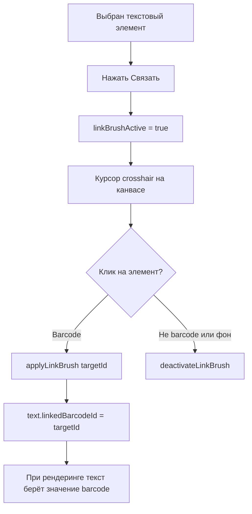

# План: Множественные штрихкоды на этикетке + связь текста с barcode

## Что требуется

1. **Устранить зависание** при добавлении barcode — `barcodeScale: 10` → `2`
2. **Каждый barcode ≠ своё значение** — несерийные barcode получают значение из общих данных (common data) по индексу (`barcode_1`, `barcode_2`...)
3. **Связь текста с конкретным barcode** — как кисточка (copy brush): нажать "Связать" на тексте → кликнуть на barcode на канвасе
4. **Заменить `inheritSerial` на `linkedBarcodeId`** — текст хранит ID barcode, с которым связан

## Изменения по файлам

### 🔧 1. [`types/label.ts`](frontend/src/types/label.ts:83) — замена inheritSerial

```typescript
// Было (из предыдущей реализации):
inheritSerial?: boolean

// Стало:
linkedBarcodeId?: string | null  // ID barcode-элемента, с которым связан текст
```

---

### 🔧 2. [`labelEditor.ts`](frontend/src/stores/labelEditor.ts)

#### a) barcodeScale: 10 → 2 (строка ~259)

```typescript
barcodeScale: 2,  // исправляет зависание при добавлении
```

#### b) Новое состояние Link Brush (после copyBrush, строка ~40)

```typescript
const linkBrushActive = ref(false);
const linkBrushSourceId = ref<string | null>(null);
```

#### c) Новые действия Link Brush (после applyCopyBrush, строка ~519)

```typescript
function activateLinkBrush(id: string): void {
  linkBrushActive.value = true;
  linkBrushSourceId.value = id;
}
function deactivateLinkBrush(): void {
  linkBrushActive.value = false;
  linkBrushSourceId.value = null;
}
function applyLinkBrush(targetId: string): void {
  const srcId = linkBrushSourceId.value;
  if (!srcId || srcId === targetId) {
    deactivateLinkBrush();
    return;
  }
  const src = elements.value[srcId];
  const tgt = elements.value[targetId];
  if (!src || !tgt || src.type !== "text" || tgt.type !== "barcode") {
    deactivateLinkBrush();
    return;
  }
  // Связываем текст с barcode
  src.props.linkedBarcodeId = targetId;
  deactivateLinkBrush();
}
```

#### d) addElement() — авто-isSerial только для первого barcode (строка ~216)

```typescript
// Перед созданием элемента:
const hasExistingSerial = Object.values(elements.value).some(
  (el) => el.type === 'barcode' && el.props.isSerial
)

// В props barcode:
isSerial: !hasExistingSerial,
```

#### e) templateTextFields — включаем несерийные barcode (строка ~102)

```typescript
const templateTextFields = computed(() => {
  const seen = new Set<string>()

  // Тексты без isSerial и без linkedBarcodeId
  const texts = Object.values(elements.value)
    .filter((el) => el.type === 'text' && !el.props.isSerial && !el.props.linkedBarcodeId)
    .filter((el) => { ... })
    .map(...)

  // Barcode без isSerial
  const barcodes = Object.values(elements.value)
    .filter((el) => el.type === 'barcode' && !el.props.isSerial)
    .filter((el) => {
      if (seen.has(el.dataField)) return false
      seen.add(el.dataField)
      return true
    })
    .map((el) => ({ dataField: el.dataField, label: el.dataField }))

  return [...texts, ...barcodes]
})
```

#### f) buildSinglePrintData() — skip linked text (строка ~468)

Заменить `!el.props.inheritSerial` на `!el.props.linkedBarcodeId`

#### g) buildTemplateData() — сохранять linkedBarcodeId (строка ~332)

`inheritSerial: el.props.inheritSerial` → `linkedBarcodeId: el.props.linkedBarcodeId`

---

### 🔧 3. [`htmlRenderer.ts`](frontend/src/assets/htmlRenderer.ts:55) + [`renderToSVG.ts`](frontend/src/assets/renderToSVG.ts:386)

Обновить `resolveValue()`:

```typescript
function resolveValue(
  element: PrintLabelElement,
  data: CommonData,
  serial?: string,
  elements?: Record<string, PrintLabelElement>,
): string {
  if (element.props.isSerial && serial !== undefined) return serial;

  if (element.type === "barcode") {
    // Non-serial barcode: сначала dataField из common data
    if (!element.props.isSerial && data[element.dataField]) {
      return data[element.dataField];
    }
    return serial ?? data["serial"] ?? data[element.dataField] ?? "";
  }

  if (element.type === "text") {
    // Текст, связанный с barcode → берём значение barcode
    if (
      element.props.linkedBarcodeId &&
      elements?.[element.props.linkedBarcodeId]
    ) {
      return resolveValue(
        elements[element.props.linkedBarcodeId],
        data,
        serial,
        elements,
      );
    }
    return data[element.dataField] ?? "";
  }

  return "";
}
```

Логика для linked barcode: если у текста есть `linkedBarcodeId`, рекурсивно разрешаем значение связанного barcode.

В цикле рендеринга передаём `elements` в resolveValue:

```typescript
const fieldValue = resolveValue(element, data, serial, elements);
```

---

### 🔧 4. [`LabelCanvas.vue`](frontend/src/components/label-editor/LabelCanvas.vue)

#### a) onElementClick — обрабатываем linkBrush (строка ~108)

```typescript
function onElementClick(id: string): void {
  if (copyBrushActive.value) {
    store.applyCopyBrush(id);
  } else if (linkBrushActive.value) {
    store.applyLinkBrush(id);
  }
}
```

#### b) onCanvasClick — деактивируем linkBrush (строка ~113)

```typescript
function onCanvasClick(): void {
  if (copyBrushActive.value) {
    store.deactivateCopyBrush();
  } else if (linkBrushActive.value) {
    store.deactivateLinkBrush();
  } else {
    selectedId.value = null;
  }
}
```

#### c) CSS для linkBrush-курсора

```css
.canvas-label--link-brush {
  cursor: crosshair;
}
.label-el--link-brush-target:hover {
  border-color: #283593 !important;
  border-style: solid !important;
  box-shadow: 0 0 0 2px rgba(40, 57, 147, 0.25) !important;
}
```

---

### 🔧 5. [`ElementPropsPanel.vue`](frontend/src/components/label-editor/ElementPropsPanel.vue)

#### a) Заменить кнопку "Связать" (inheritSerial) на активацию linkBrush

```html
<v-tooltip
  text="Связать с штрихкодом: нажмите, затем кликните на barcode на макете"
  location="bottom"
>
  <template #activator="{ props: tp }">
    <button
      v-bind="tp"
      :class="['btn', 'btn--lbl', { 'btn--link': selectedElement!.props.linkedBarcodeId }]"
      @click="store.activateLinkBrush(selectedId!)"
    >
      <v-icon size="14">mdi-link-variant</v-icon><span>Связать</span>
    </button>
  </template>
</v-tooltip>
<!-- Если уже связан, показать ID barcode -->
<span v-if="selectedElement!.props.linkedBarcodeId" class="link-hint">
  → {{ selectedElement!.props.linkedBarcodeId }}
</span>
```

#### b) Добавить computed для доступа к store

```typescript
const linkBrushActive = computed(() => store.linkBrushActive);
```

---

## Диаграмма потока "Связь текста с barcode"



## Проверка регрессии

| Сценарий                   | Ожидание                                    |
| -------------------------- | ------------------------------------------- |
| Добавить 1 barcode         | isSerial=true, масштаб 2 (нет зависания) ✅ |
| Добавить 2 barcode         | isSerial=false, данные из common ✅         |
| Пакетная печать 2 barcode  | #1 = serial, #2 = из common ✅              |
| Связать текст с barcode    | Текст показывает то же значение ✅          |
| Сохранить/загрузить шаблон | linkedBarcodeId сохраняется ✅              |
| Старые шаблоны             | linkedBarcodeId=undefined → игнор ✅        |
