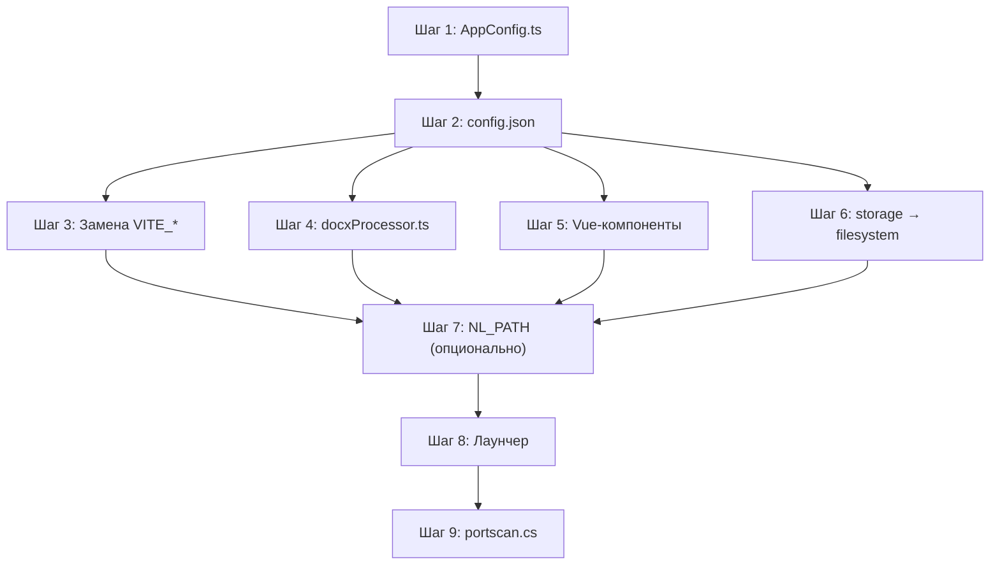

# План рефакторинга: отвязка приложения TAU от сетевых ресурсов

## 1. Проблема

Приложение TAU (NeutralinoJS) имеет **жёстко зашитые UNC-пути** к файловому серверу `rucekaspinffs05.metran.local` в >10 местах кода, а также использует **относительные системные папки** (`.tmp/`, `./convertFolder/`, `storage`), которые привязаны к `NL_PATH`.

Это приводит к:

- Невозможности обновить `TAU.exe` пока он запущен (файл заблокирован SMB)
- Поломке функционала при перемещении/переименовании сетевых папок
- Отсутствию доступа у части пользователей к конкретным папкам

## 2. Аудит: полный список привязок

### 2.1. Жёсткая привязка к `rucekaspinffs05.metran.local`

| #   | Файл                                                 | Строка                     | Что делает                                  |
| --- | ---------------------------------------------------- | -------------------------- | ------------------------------------------- |
| 1   | `frontend/.env.development`                          | 3-5                        | VITE_OK_PATH, VITE_KD_PATH, VITE_OTHER_PATH |
| 2   | `frontend/.env.production`                           | 3-5                        | Те же переменные                            |
| 3   | `frontend/src/components/views/_ProductAssembly.vue` | 317-318, 324, 492          | Чтение/открытие ОК (операционных карт) PDF  |
| 4   | `frontend/src/components/views/ProductAssembly.vue`  | 266-268, 274, 366-367, 375 | Чтение/открытие ОК PDF, КД PDF              |
| 5   | `frontend/src/components/views/ProductAssembly.vue`  | 446, 517-518               | Список ОК PDF, чтение директории паспортов  |
| 6   | `frontend/src/components/views/ProductMarking.vue`   | 217                        | Открытие папки гравировки                   |
| 7   | `frontend/src/components/views/PreProduction.vue`    | 349                        | Открытие PDF руководства                    |
| 8   | `frontend/src/components/views/DevView.vue`          | 169, 194-196, 203-204      | Копирование/чтение КД                       |
| 9   | `frontend/src/components/views/AddArticle.vue`       | 206                        | Открытие ОК PDF                             |
| 10  | `frontend/src/components/printPassports.vue`         | 15                         | Путь к паспортам                            |
| 11  | `frontend/src/assets/docxProcessor.ts`               | 202                        | `passportDir`                               |
| 12  | `frontend/public/portscan.cs`                        | 19                         | Список хостов для сканирования              |
| 13  | `.storage/serverPath.neustorage`                     | 1                          | Сохранённый путь к КД                       |
| 14  | `server/prisma-backup*.json`                         | —                          | markingTemplate внутри данных БД            |

### 2.2. Привязка к системным папкам (`.tmp`, `convertFolder`, `storage`, `NL_PATH`)

| #   | Файл                                            | Строка                 | Что использует                         |
| --- | ----------------------------------------------- | ---------------------- | -------------------------------------- |
| 1   | `frontend/src/assets/docxProcessor.ts`          | 200, 253, 308, 321     | `./convertFolder`                      |
| 2   | `frontend/src/assets/fontManager.ts`            | 46-48, 71              | `.tmp/fonts-db.json`, `.tmp/previews`  |
| 3   | `frontend/src/assets/createFileForPrint.ts`     | 54, 83                 | `.tmp/print-label.html`                |
| 4   | `frontend/src/assets/printLabelMultyСopy.ts`    | 54, 62                 | `.tmp/`                                |
| 5   | `frontend/src/assets/printLabel.ts`             | 63, 218                | `.tmp/`                                |
| 6   | `frontend/src/assets/printLabelMulty.ts`        | 91, 104                | `.tmp/`                                |
| 7   | `frontend/src/assets/renderToSVG.ts`            | 32                     | `.tmp/fonts`                           |
| 8   | `frontend/src/assets/utils/authWin.ts`          | 28                     | `.tmp/auth.exe`                        |
| 9   | `frontend/src/assets/utils/authConfig.ts`       | 10                     | `.tmp/authConfig.json`                 |
| 10  | `frontend/src/stores/labelEditor.ts`            | 536-537, 544, 663, 740 | Save/Load через `filesystem.writeFile` |
| 11  | `frontend/src/stores/svgEditor.ts`              | 294                    | `filesystem.writeFile`                 |
| 12  | `frontend/src/assets/utils/openSecondWindow.ts` | 1, 18, 20, 21          | `storage` API                          |
| 13  | `frontend/src/assets/utils/authYandex.ts`       | 19, 125                | `storage` API                          |
| 14  | `frontend/src/stores/user.ts`                   | 152-153                | `.tmp/authConfig.json`                 |

## 3. Архитектура решения

### 3.1. Принцип "Код отдельно — данные отдельно"

```
До рефакторинга:
                     ┌──────────────────────────────────────────────┐
                     │  TAU.exe  (в сетевой папке)                  │
                     │                                              │
                     │  Код:                                        │
                     │    frontend/dist/  ← NL_PATH                 │
                     │    .tmp/                                     │
                     │    convertFolder/                             │
                     │                                              │
                     │  Данные (хардкод UNC):                       │
                     │    \\server\...\Паспорта                      │
                     │    \\server\...\Операционные карты            │
                     │    \\server\...\КД                            │
                     │    \\server\...\Наклейки                      │
                     └──────────────────────────────────────────────┘

После рефакторинга:
  Локально (C:\Users\...\AppData\Local\TAU\):
    TAU.exe
    frontend/dist/
    .tmp/
    config.json  ← централизованные пути

  В сети (\\server\share\TAU\):
    convertFolder/
    config.json  ← master-копия конфига (если нужно)

  Данные (по UNC из config.json):
    \\server\...\Паспорта
    \\server\...\Операционные карты
    \\server\...\КД
    \\server\...\Наклейки
```

### 3.2. Новая структура: `config.json` (централизованный конфиг)

Файл `config.json` в корне приложения (рядом с TAU.exe):

```json
{
  "version": "1.0.0",
  "paths": {
    "ok": "//server/Dept-MP/Production/Internal/Продукты/ТАУ/Операционные карты/ОК PDF",
    "kd": "//server/Dept-MP/Production/Internal/Продукты/ТАУ/КД",
    "passports": "//server/Dept-MP/Production/Internal/Продукты/ТАУ/Паспорта",
    "marking": "//server/Dept-MP/Production/Internal/Продукты/ТАУ/Наклейки/Гравировка",
    "other": "//server/Dept-MP/Production/Internal/Продукты/ТАУ/Софт/прикладные документы",
    "convertFolder": "./convertFolder"
  },
  "services": {
    "wsUrl": "10.69.19.59:3000",
    "apiUrl": "http://10.69.19.59:3000"
  }
}
```

### 3.3. Загрузчик конфига: `AppConfig`

Создать сервис (модуль), который загружает `config.json` при старте:

```typescript
// frontend/src/assets/utils/AppConfig.ts
import { filesystem } from "@neutralinojs/lib";

export interface AppPaths {
  ok: string;
  kd: string;
  passports: string;
  marking: string;
  other: string;
  convertFolder: string;
}

export interface AppConfigData {
  version: string;
  paths: AppPaths;
}

class AppConfig {
  private data: AppConfigData | null = null;

  async load(): Promise<void> {
    const raw = await filesystem.readFile("./config.json");
    this.data = JSON.parse(raw);
  }

  get paths(): AppPaths {
    if (!this.data) throw new Error("AppConfig not loaded");
    return this.data.paths;
  }
}

export const appConfig = new AppConfig();
```

## 4. Пошаговый план рефакторинга

### Шаг 1: Создать `frontend/src/assets/utils/AppConfig.ts`

Загрузчик конфигурации с кэшированием и валидацией.

### Шаг 2: Создать `config.json` в корне проекта

Собрать все пути из `.env` и хардкода в один файл.

### Шаг 3: Заменить `VITE_OK_PATH`, `VITE_KD_PATH`, `VITE_OTHER_PATH`

Эти переменные используются в компонентах через `import.meta.env`. Найти все места и заменить на `appConfig.paths.*`.

Поиск по шаблону: `import.meta.env.VITE_OK_PATH`, `import.meta.env.VITE_KD_PATH`, `import.meta.env.VITE_OTHER_PATH`

### Шаг 4: Заменить хардкод в `docxProcessor.ts`

- `CONFIG.passportDir` → `appConfig.paths.passports`
- `CONFIG.convertPath` → `appConfig.paths.convertFolder`

### Шаг 5: Заменить хардкод в компонентах `.vue`

- `ProductAssembly.vue` — заменить `\\\\rucekaspinffs05...` на `appConfig.paths.ok` и `appConfig.paths.kd` и `appConfig.paths.passports`
- `ProductMarking.vue` — заменить на `appConfig.paths.marking`
- `PreProduction.vue` — заменить на `appConfig.paths.other`
- `DevView.vue` — заменить на `appConfig.paths.kd`
- `AddArticle.vue` — заменить на `appConfig.paths.ok`
- `printPassports.vue` — заменить на `appConfig.paths.passports`

### Шаг 6: Заменить `storage` API на `filesystem`

NeutralinoJS `storage` использует `.storage/` рядом с конфигом. Заменить на прямую запись в `.tmp/` через `filesystem.writeFile`:

- `openSecondWindow.ts` — `storage.setData` → `filesystem.writeFile` в `.tmp/`
- `exchangeCode.ts` — `storage.getData` → `filesystem.readFile` из `.tmp/`
- `authYandex.ts` — `storage.setData/getData` → `filesystem.readFile/writeFile` из `.tmp/`

### Шаг 7: Заменить `NL_PATH` на переменную окружения/конфиг (опционально)

Для полной отвязки от `NL_PATH` в местах где он используется для `.tmp/`:

- `window.NL_PATH + '/.tmp/'` → заменить на константу из AppConfig или на `os.getEnv('TAU_TMP_PATH') || window.NL_PATH + '/.tmp'`

Но это менее критично — `.tmp/` будет локальным если приложение запускается локально.

### Шаг 8: Лаунчер (отдельная задача)

После рефакторинга путей — создать `launcher.ps1`, который:

1. Копирует `TAU.exe` + `frontend/dist/` + `config.json` в `%LOCALAPPDATA%\TAU\`
2. Запускает локальную копию
3. При обновлении — просто заменяет файлы в сетевой папке

### Шаг 9: `portscan.cs` — отдельно

Список хостов в `portscan.cs` можно вынести в `config.json` или оставить как есть (это диагностическая утилита).

## 5. Порядок выполнения



## 6. Риски и замечания

1. **Обратная совместимость**: старые `config.json` без новых полей — предусмотреть fallback-значения (хардкодные UNC как запасной вариант).
2. **Асинхронная загрузка**: `appConfig.load()` нужно вызывать при старте приложения, до того как любой компонент попробует его использовать. Добавить в `main.ts` или в `App.vue`.
3. **`storage` API**: NeutralinoJS `storage` работает через `NL_STORAGE` и файл `.storage/`. Замена на `filesystem` безопасна.
4. **`NL_PATH`**: Удалить полностью не получится — NeutralinoJS использует его для HTTP-сервера ресурсов. Но для пользовательского кода можно минимизировать.
5. **`markingTemplate` в данных БД**: Это поле в `prisma-backup*.json` (`specification.markingTemplate`) содержит UNC-путь как _данные_, а не как код. Их можно не трогать — это legacy-записи.

## 7. Итоговый чеклист изменяемых файлов

### Новые файлы:

- [ ] `config.json` — центральный конфиг
- [ ] `frontend/src/assets/utils/AppConfig.ts` — загрузчик конфига

### Изменяемые файлы:

- [ ] `frontend/.env.development` — удалить VITE_OK_PATH, VITE_KD_PATH, VITE_OTHER_PATH
- [ ] `frontend/.env.production` — удалить те же переменные
- [ ] `frontend/src/assets/docxProcessor.ts` — замена passportDir, convertPath
- [ ] `frontend/src/components/views/ProductAssembly.vue` — 7 мест
- [ ] `frontend/src/components/views/_ProductAssembly.vue` — 3 места
- [ ] `frontend/src/components/views/ProductMarking.vue` — 1 место
- [ ] `frontend/src/components/views/PreProduction.vue` — 1 место
- [ ] `frontend/src/components/views/DevView.vue` — 3 места
- [ ] `frontend/src/components/views/AddArticle.vue` — 1 место
- [ ] `frontend/src/components/printPassports.vue` — 1 место
- [ ] `frontend/src/assets/utils/openSecondWindow.ts` — storage → filesystem
- [ ] `frontend/src/assets/utils/exchangeCode.ts` — storage → filesystem
- [ ] `frontend/src/assets/utils/authYandex.ts` — storage → filesystem

### Опционально (Шаг 7):

- [ ] `frontend/src/assets/createFileForPrint.ts` — NL_PATH
- [ ] `frontend/src/assets/printLabel.ts` — NL_PATH
- [ ] `frontend/src/assets/printLabelMulty.ts` — NL_PATH
- [ ] `frontend/src/assets/printLabelMultyСopy.ts` — NL_PATH
- [ ] `frontend/src/assets/renderToSVG.ts` — NL_PATH
- [ ] `frontend/src/assets/fontManager.ts` — NL_PATH
- [ ] `frontend/src/assets/utils/authWin.ts` — NL_PATH
- [ ] `frontend/src/assets/utils/authConfig.ts` — NL_PATH
