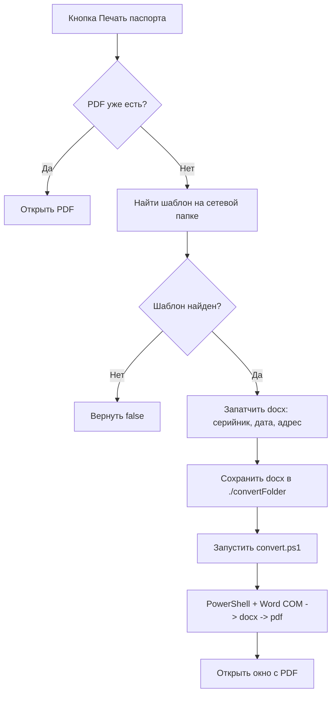
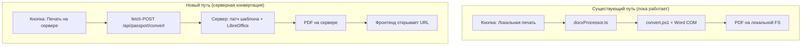

# План рефакторинга: Печать отгрузочного паспорта (отвязка от MS Word и ps1)

## 1. Текущая архитектура (as-is)

В системе существует **2 точки входа** для печати отгрузочного паспорта:

### 1.1 `openPrintPassportWindow` — [`ProductAssembly.vue:725`](../frontend/src/components/views/ProductAssembly.vue#725) (одиночная печать)

- Вызывается из вьюхи сборки, для одного продукта
- Берёт `partNumber` и `serialNumber` из данных продукта
- Открывает второе окно ([`printLable.vue`](../frontend/src/components/views/printLable.vue)) **ДО** того как PDF готов
- Вызывает [`printPassport(partNumber, serialNumber)`](../frontend/src/assets/docxProcessor.ts#410)

### 1.2 `handlePrint` — [`printPassports.vue:76`](../frontend/src/components/printPassports.vue#76) (пакетная печать)

- Пользователь вводит артикул и несколько серийных номеров
- Вызывает `printPassport(partNumber, serials)` для всех серийников
- Склеивает PDF, удаляет промежуточные docx, открывает окно просмотра

### Общий конвейер ([`docxProcessor.ts`](../frontend/src/assets/docxProcessor.ts)):



---

## 2. Выявленные слабые места

### 🔴 Критические

| №   | Проблема                                                | Где                                                                                        | Описание                                                                      |
| --- | ------------------------------------------------------- | ------------------------------------------------------------------------------------------ | ----------------------------------------------------------------------------- |
| 1   | **Жёсткая привязка к MS Word**                          | [`convert.ps1:97`](../frontend/public/convert.ps1#L97)                                     | `New-Object -ComObject Word.Application`. Без Word — конвейер не работает     |
| 2   | **convert.ps1 конвертирует ВСЕ docx в папке**           | [`convert.ps1:107`](../frontend/public/convert.ps1#L107)                                   | Нет изоляции — может подхватить чужие/старые файлы                            |
| 3   | **Окно открывается ДО готовности PDF**                  | [`ProductAssembly.vue:742-744`](../frontend/src/components/views/ProductAssembly.vue#L742) | `openSecondWindow` до `printPassport`. Окно зависнет, если конвертация упадёт |
| 4   | **Конвертация вызывается только для первого серийника** | [`docxProcessor.ts:434`](../frontend/src/assets/docxProcessor.ts#L434)                     | `safelyConvert(partNumber, serialNumbers[0])` — работает случайно             |

### 🟡 Существенные

| №   | Проблема                                             | Где                      | Описание                                                      |
| --- | ---------------------------------------------------- | ------------------------ | ------------------------------------------------------------- |
| 5   | **Нет нормальной обработки ошибок для пользователя** | `docxProcessor.ts`       | Ошибки в console, пользователю — `alert('Ошибка при печати')` |
| 6   | **Мёртвый конфиг**                                   | `docxProcessor.ts:205`   | `searchKey: 'плата 2'` нигде не используется                  |
| 7   | **Закомментированный код**                           | `docxProcessor.ts:1-190` | Почти 200 строк мёртвого кода                                 |
| 8   | **Типизация `any`**                                  | `docxProcessor.ts:327`   | `evt: any` в обработчике spawnedProcess                       |

---

## 3. Стратегия: Итеративное внедрение (не ломая текущее)

### Принцип:

1. **Ничего не ломать** — существующий конвейер (Word COM + ps1) остаётся работать как есть
2. **Добавить параллельный путь** — новый серверный endpoint конвертации через LibreOffice
3. **Кнопка выбора** — пользователь сам решает, каким способом конвертировать
4. **После валидации** — удалить локальный путь

### Целевая архитектура (to-be):



---

## 4. План по этапам

### Этап 1: Проверка LibreOffice на сервере + endpoint docx→pdf

**Цель:** Убедиться, что LibreOffice работает на сервере, и создать endpoint для конвертации.

**Изменения — только сервер, фронтенд не трогаем.**

- [ ] **1.1** Установить/проверить LibreOffice на сервере (команда: `soffice --headless --convert-to pdf --outdir /tmp/test /tmp/test.docx`)
- [ ] **1.2** Создать файл маршрута [`server/routes/passport.ts`](../server/routes/passport.ts) с endpoint:

```typescript
// GET /api/passport/check-soffice — проверка доступности LibreOffice
// POST /api/passport/convert — принимает { partNumber, serialNumber }
//   - Находит шаблон на сетевой папке (как сейчас findFileInDirectory)
//   - Патчит docx (используя docx библиотеку или копируя логику patchDocx)
//   - Конвертирует docx→pdf через child_process: soffice --headless --convert-to pdf
//   - Сохраняет PDF в /tmp/passports/ или ./uploads/passports/
//   - Возвращает { pdfUrl: string }
```

- [ ] **1.3** Зарегистрировать роут в [`server/index.ts`](../server/index.ts) — `passportRoutes(app)`
- [ ] **1.4** Подключить `@fastify/static` для раздачи сгенерированных PDF (уже подключён для uploads)
- [ ] **1.5** Добавить обработку ошибок: таймаут, нет soffice, битый docx

**Важно:** На этом этапе endpoint возвращает PDF, но фронтенд его пока не вызывает.

### Этап 2: Кнопка «Конвертация на сервере» в одиночной печати

**Цель:** Добавить UI-элемент для выбора способа конвертации при одиночной печати.

**Изменения — только фронтенд, ProductAssembly.vue.**

- [ ] **2.1** В [`ProductAssembly.vue`](../frontend/src/components/views/ProductAssembly.vue) рядом с существующей кнопкой "Печать отгрузочного паспорта" добавить вторую кнопку **«Печать (сервер)»** с вызовом нового метода `printPassportServer(partNumber, serialNumber)`
- [ ] **2.2** Создать новый файл [`frontend/src/assets/passportClient.ts`](../frontend/src/assets/passportClient.ts) с функцией:

```typescript
export async function printPassportServer(
  partNumber: string,
  serialNumber: string,
): Promise<{ pdfUrl: string } | null> {
  const response = await fetch(`${API_URL}/api/passport/convert`, {
    method: "POST",
    headers: { "Content-Type": "application/json" },
    body: JSON.stringify({ partNumber, serialNumber }),
  });
  if (!response.ok) return null;
  return response.json();
}
```

- [ ] **2.3** После успешного ответа от сервера — открывать PDF через `window.open(pdfUrl)` или через `openSecondWindow` с URL сервера (вместо локального файла)

### Этап 3: Пакетная печать через сервер

**Цель:** Добавить опцию серверной конвертации в [`printPassports.vue`](../frontend/src/components/printPassports.vue).

- [ ] **3.1** В компонент пакетной печати добавить переключатель/кнопку для выбора способа конвертации
- [ ] **3.2** При выборе "сервер" — вызывать `POST /api/passport/convert` с массивом серийников
- [ ] **3.3** Ответ: сервер присылает один склеенный PDF URL (склейка через `pdf-lib`)

### Этап 4: Валидация и замена

**Цель:** Убедиться, что серверная конвертация работает стабильно, и удалить старый код.

- [ ] **4.1** Сравнить вывод PDF (Word vs LibreOffice) — визуально и по структуре страниц
- [ ] **4.2** Прогнать несколько тестовых сценариев: разные артикулы, разные шаблоны, пачки серийников
- [ ] **4.3** Если качество устраивает — удалить:
  - `convert.ps1`, `convert2.ps1`, `convert.vbs`, `convert2.vbs`, `simpleConvert.*`
  - Функции локальной конвертации из `docxProcessor.ts`
  - Импорты `@neutralinojs/lib` из `docxProcessor.ts` (кроме тех, что ещё нужны)
- [ ] **4.4** Удалить старые кнопки локальной печати, оставить только серверный путь
- [ ] **4.5** Исправить race condition в `openPrintPassportWindow` — сначала получить PDF URL, потом открывать окно

---

## 5. API-контракт (итерация 1)

### `POST /api/passport/convert`

```typescript
// Request
{
  partNumber: string          // Артикул изделия (обязательно)
  serialNumbers: string[]     // Массив серийных номеров (1 или больше)
}

// Response (200)
{
  success: true
  pdfUrl: string              // URL для открытия PDF
  pdfName: string             // Имя файла
  pagesCount: number          // Общее количество страниц
}

// Response (4xx/5xx)
{
  success: false
  error: string
  code: 'TEMPLATE_NOT_FOUND' | 'SOFFICE_NOT_FOUND' | 'CONVERSION_FAILED' | 'PATCH_FAILED'
}
```

### `GET /api/passport/check-soffice`

```typescript
// Response (200)
{
  available: boolean
  version?: string
  error?: string
}
```

---

## 6. Серверная среда

| Параметр           | Значение                                                                                                                                                      |
| ------------------ | ------------------------------------------------------------------------------------------------------------------------------------------------------------- |
| Runtime            | Bun (через `server/index.ts`)                                                                                                                                 |
| Фреймворк          | Fastify                                                                                                                                                       |
| Уже есть           | `@fastify/multipart`, `@fastify/static`, `@fastify/cors`                                                                                                      |
| Аутентификация     | `x-api-key` header (в `server/index.ts:46-51`)                                                                                                                |
| Сетевые пути (UNC) | `//rucekaspinffs05.metran.local/...` — доступны через `filesystem.readDirectory` на Neutralino, **но сервер (Bun) должен иметь доступ к этим путям напрямую** |

> **Важно:** Сервер (Bun) обращается к сетевым папкам через стандартные Node.js `fs` / `fs/promises`. Убедиться, что у процесса Bun есть права доступа к UNC-путям.

---

## 7. Критические риски

| Риск                                                    | Вероятность | Митигация                                                                                                                       |
| ------------------------------------------------------- | ----------- | ------------------------------------------------------------------------------------------------------------------------------- |
| LibreOffice не установлен                               | Средняя     | Endpoint `check-soffice` покажет статус. Установить через `apt install libreoffice-core` или `yum install libreoffice-headless` |
| Разница форматирования docx → pdf (Word vs LibreOffice) | Высокая     | Этап 4 — обязательное сравнение. При сильных отличиях — доработать шаблоны или использовать `docx` npm lib для прямой генерации |
| UNC-пути недоступны серверу                             | Средняя     | Проверить на этапе 1. Решение: смонтировать сетевую папку как локальный диск или скопировать шаблоны на сервер                  |
| Таймаут конвертации большого количества серийников      | Средняя     | Установить разумный таймаут (30-60 сек). Для больших пачек — асинхронная очередь                                                |

---

## 8. Файлы, которые будут изменены/созданы

### Новые файлы:

- `server/routes/passport.ts` — серверный endpoint
- `frontend/src/assets/passportClient.ts` — клиент для вызова сервера

### Изменяемые файлы:

- `server/index.ts` — регистрация нового роута
- `frontend/src/components/views/ProductAssembly.vue` — новая кнопка
- `frontend/src/components/printPassports.vue` — опция серверной конвертации (этап 3)

### Удаляемые файлы (этап 4):

- `frontend/public/convert.ps1`
- `frontend/public/convert2.ps1`
- `frontend/public/convert.vbs`
- `frontend/public/convert2.vbs`
- `frontend/public/simpleConvert.ps1`
- `frontend/public/simpleConvert.vbs`
