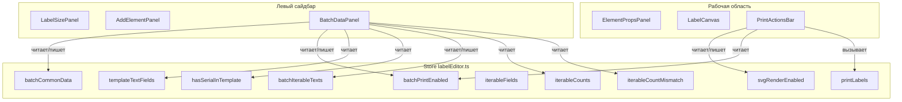

# План: Перенос групповой печати в левый сайдбар

## Текущая архитектура

```
LabelEditor.vue
  └── .app-main (flex-row)
       ├── .app-sidebar (300px, слева)
       │    ├── LabelSizePanel
       │    └── AddElementPanel
       └── .app-workspace (flex: 1, центр)
            ├── .ribbon-wrap → ElementPropsPanel (overlay)
            ├── .canvas-scroll → LabelCanvas
            └── .print-panel (max-height: 300px, внизу)
                 └── PrintDataPanel.vue
                      ├── .pp-topbar (40px, горизонтальная панель)
                      │    ├── индикатор файла
                      │    ├── spacer
                      │    ├── кнопка SVG-рендера
                      │    ├── переключатель "Серия"
                      │    ├── разделитель
                      │    └── кнопка "Печать"
                      └── .pp-batch-body (схлопываемый, показывается когда batchPrintEnabled)
                           ├── общие поля (templateTextFields)
                           └── итерируемые barcode (iterableFields)
```

## Желаемая архитектура

```
LabelEditor.vue
  └── .app-main (flex-row)
       ├── .app-sidebar (300px, слева)
       │    ├── LabelSizePanel
       │    ├── AddElementPanel
       │    ├── sidebar-divider
       │    └── BatchDataPanel.vue (НОВЫЙ — данные групповой печати)
       │         ├── переключатель "Серия"
       │         ├── общие поля (templateTextFields)
       │         └── итерируемые barcode (iterableFields)
       └── .app-workspace (flex: 1, центр)
            ├── .ribbon-wrap → ElementPropsPanel
            ├── .canvas-scroll → LabelCanvas
            └── .print-actions-bar (компактная, ~36px, внизу)
                 └── PrintActionsBar.vue (НОВЫЙ — только кнопки действий)
                      ├── индикатор файла
                      ├── spacer
                      ├── кнопка SVG-рендера
                      ├── разделитель
                      └── кнопка "Печать" (счётчик при batch-режиме)
```

## Детальный план изменений

### Шаг 1. Создать `frontend/src/components/label-editor/BatchDataPanel.vue`

Новый компонент, который содержит **только** логику ввода данных групповой печати:

- **Переключатель "Серия"** (toggle `batchPrintEnabled`)
  - Блокируется, если `hasSerialInTemplate === false`
  - При отключении — скрывает поля ввода
- **Общие поля** (`templateTextFields`) — поля ввода для каждого текстового/barcode поля без isSerial
- **Итерируемые barcode** (`iterableFields`) — textarea для ввода значений каждого итерируемого barcode
  - Предупреждение о несовпадении количества (`iterableCountMismatch`)
  - Счётчик строк для каждого поля

Пропсы/стейт: все берутся из `labelEditor` store (через `storeToRefs`), как и сейчас.

Стили: адаптировать под вертикальную компоновку в сайдбаре (сейчас `.pp-fields-grid` — горизонтальная сетка `auto 1fr`).

### Шаг 2. Создать `frontend/src/components/label-editor/PrintActionsBar.vue`

Новый компактный компонент для нижней панели:

- **Индикатор файла** (какой шаблон открыт)
- **Кнопка SVG-рендера** (toggle `svgRenderEnabled`)
- **Кнопка "Печать"** (вызывает `store.printLabels`)
  - Показывает счётчик `(X шт.)` когда `batchPrintEnabled`
- Никаких полей ввода данных — только кнопки управления

Высота: ~36px (как у titlebar), минимальная, чтобы не занимать место.

### Шаг 3. Модифицировать `LabelEditor.vue`

- **Импорт**: заменить `PrintDataPanel` на `BatchDataPanel` и `PrintActionsBar`
- **`.app-sidebar`**: добавить `BatchDataPanel` после `AddElementPanel` (с разделителем)
- **`.app-workspace`**: заменить `.print-panel` (с `PrintDataPanel`) на `.print-actions-bar` (с `PrintActionsBar`)
- **`.sidebar-scroll`**: убедиться, что контент скроллируется вместе с остальными панелями

### Шаг 4. Удалить `PrintDataPanel.vue`

После того как вся функциональность перенесена в два новых компонента.

### Шаг 5. Проверить стили

- `.pp-fields-grid` сейчас `grid-template-columns: auto 1fr` — в сайдбаре может потребоваться `1fr` или растягивание на всю ширину
- `.pp-iterable-fields` сейчас `width: 200px` — в сайдбаре должно быть `width: 100%`
- Убрать `max-height: 300px` со старого `.print-panel`, заменить на простую фиксированную высоту для `.print-actions-bar`
- Убедиться, что `.sidebar-scroll` корректно скроллится при переполнении (batch-данные могут быть большими)

## Схема взаимодействия компонентов



## Визуализация изменений в `.app-sidebar`

Сейчас:

```
┌──────────────────────────────┐
│  LabelSizePanel              │
├──────────────────────────────┤
│  AddElementPanel             │
└──────────────────────────────┘
```

После:

```
┌──────────────────────────────┐
│  LabelSizePanel              │
├──────────────────────────────┤
│  AddElementPanel             │
├─── divider ──────────────────┤
│  BatchDataPanel              │
│  ┌────────────────────────┐  │
│  │ [Серия] ◉━━━━━━━━━○    │  │
│  │                        │  │
│  │ Общие данные           │  │
│  │ ┌────────────────────┐ │  │
│  │ │ field1: [______]   │ │  │
│  │ │ field2: [______]   │ │  │
│  │ └────────────────────┘ │  │
│  │                        │  │
│  │ Итерируемые barcode    │  │
│  │ ┌────────────────────┐ │  │
│  │ │ AA1                │ │  │
│  │ │ AA2                │ │  │
│  │ │ AA3                │ │  │
│  │ └────────────────────┘ │  │
│  └────────────────────────┘  │
└──────────────────────────────┘
```

## Затрагиваемые файлы

| Файл                                                       | Действие |
| ---------------------------------------------------------- | -------- |
| `frontend/src/components/label-editor/PrintDataPanel.vue`  | Удалить  |
| `frontend/src/components/label-editor/BatchDataPanel.vue`  | Создать  |
| `frontend/src/components/label-editor/PrintActionsBar.vue` | Создать  |
| `frontend/src/components/LabelEditor.vue`                  | Изменить |
