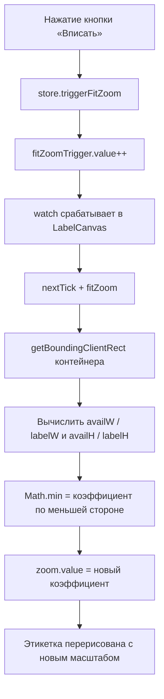

# План исправления `fitZoom()` — версия 2

## Диагностика проблемы

`fitZoom()` не работает корректно, потому что **`.canvas-container` (ref `containerEl`) не имеет ограничения по высоте**.

### DOM-структура:

```
app-workspace (flex, column)
  └── .canvas-scroll (flex: 1, overflow: auto) ← НЕТ display:flex!
       └── .canvas-container (flex: 1, padding: 24px) ← flex:1 не работает
            └── .canvas-label (этикетка)
            └── .zoom-hint (подсказка)
```

### Почему это проблема:

[`.canvas-scroll`](frontend/src/components/LabelEditor.vue:392) имеет `flex: 1` (растягивается в родителе), но **не имеет `display: flex`**. Поэтому `flex: 1` у дочернего [`.canvas-container`](frontend/src/components/label-editor/LabelCanvas.vue:252) **игнорируется** — контейнер не ограничен по высоте and растягивается по содержимому.

В результате:

- [`containerEl.value.clientHeight`](frontend/src/components/label-editor/LabelCanvas.vue:43) ≈ высота `.canvas-label` + padding + подсказка
- `(ch - 96) / labelH` ≈ `(labelH*zoom + отступы - 96) / labelH` ≈ 1 (или близко к текущему zoom)
- zoom не меняется, этикетка не подгоняется

## Что исправить

### 1. [`LabelEditor.vue`](frontend/src/components/LabelEditor.vue:392) — CSS

Добавить `display: flex; flex-direction: column` к `.canvas-scroll`:

```css
.canvas-scroll {
  flex: 1;
  display: flex;
  flex-direction: column;
  overflow: auto;
  min-height: 0;
}
```

Это заставит `.canvas-container` (с `flex: 1`) заполнять всю доступную высоту рабочей области, и `clientHeight` будет возвращать корректное значение.

### 2. [`LabelCanvas.vue`](frontend/src/components/label-editor/LabelCanvas.vue:40) — `fitZoom()`

Упростить и уточнить формулу — использовать `getBoundingClientRect()` для получения точных размеров, убрать `FIT_PADDING` и вычислять отступы из CSS:

```typescript
function fitZoom() {
  if (!containerEl.value) return;
  const rect = containerEl.value.getBoundingClientRect();
  const cw = rect.width;
  const ch = rect.height;
  if (cw === 0 || ch === 0) return;

  const labelW = labelSizeMM.value.width * MM_TO_PX;
  const labelH = labelSizeMM.value.height * MM_TO_PX;

  // Отступы: padding контейнера 24px + визуальный зазор 24px = 48px с каждой стороны
  const padding = 48;
  const availW = cw - padding * 2;
  const availH = ch - padding * 2;
  if (availW <= 0 || availH <= 0) return;

  // Math.min — вписываем по меньшей стороне, чтобы этикетка полностью поместилась
  const raw = Math.min(availW / labelW, availH / labelH);
  zoom.value = Math.min(9, Math.max(0.5, Math.round(raw * 10) / 10));
}
```

### 3. Почему алгоритм правильный

Пользователь сказал: «если этикетка 200×600px, а область 600×1000px, то подгонять по ширине».

| Ось    | Этикетка | Область | Коэффициент     |
| ------ | -------- | ------- | --------------- |
| Ширина | 600px    | 1000px  | 1000/600 = 1.67 |
| Высота | 200px    | 600px   | 600/200 = 3.0   |

`Math.min(1.67, 3.0) = 1.67` — подгоняет по ширине (1.67), этикетка становится 334×1000px и полностью помещается. Это ровно то, что нужно.

### Схема работы после исправления:



## Файлы для изменения

1. [`frontend/src/components/LabelEditor.vue`](frontend/src/components/LabelEditor.vue:392) — CSS `.canvas-scroll`
2. [`frontend/src/components/label-editor/LabelCanvas.vue`](frontend/src/components/label-editor/LabelCanvas.vue:40) — `fitZoom()`
