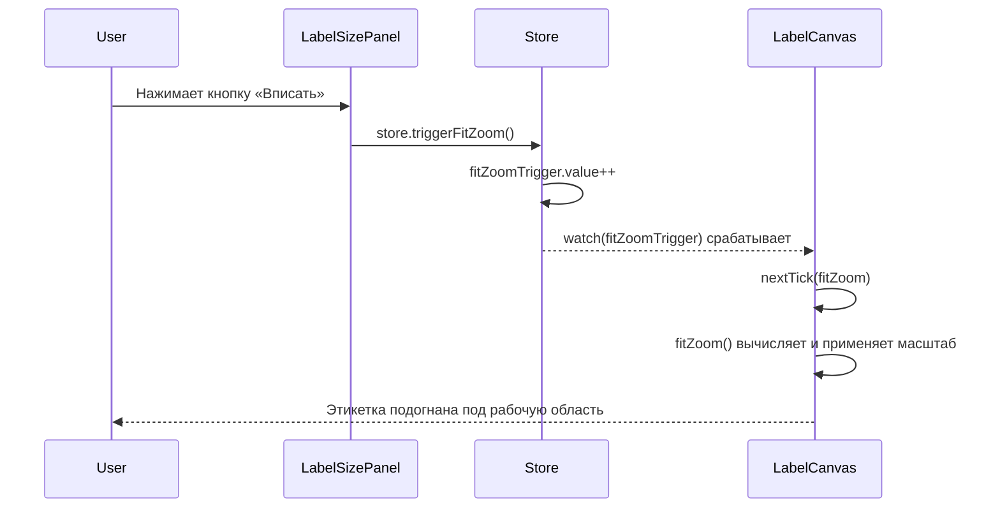

# План исправления `resetFit()`

## Проблема

Функция [`resetFit()`](frontend/src/components/label-editor/LabelSizePanel.vue:12) в компоненте `LabelSizePanel` должна подгонять масштаб этикетки под рабочую область, вызывая `fitZoom()` в [`LabelCanvas.vue`](frontend/src/components/label-editor/LabelCanvas.vue:32).

**Текущая реализация — хак:**

```typescript
// LabelSizePanel.vue
function resetFit() {
  const w = labelSize.value.width;
  labelSize.value.width = w + 0.001; // временно меняем ширину
  requestAnimationFrame(() => {
    labelSize.value.width = w; // восстанавливаем
  });
}
```

Этот код:

1. Изменяет `labelSize.width` на 0.001 мм
2. Надеется, что это вызовет `watch(labelSizeMM, ...)` в `LabelCanvas.vue`
3. Восстанавливает исходную ширину в `requestAnimationFrame`

### Почему это плохо:

- **Ненадёжно**: 0.001 мм может быть отфильтровано системой реактивности или округлено
- **Гонка состояний**: `requestAnimationFrame` может сработать до или после `nextTick(fitZoom)` — непредсказуемо
- **Побочный эффект**: мутация `labelSize.width` ради вызова колбэка — антипаттерн
- **Сложно отлаживать**: причина мутации значения неочевидна для нового разработчика

## Решение

Заменить хак на **сигнальный механизм** (уже используется в проекте — см. `templateKey`).

### Изменения в 3 файлах:

#### 1. [`store/labelEditor.ts`](frontend/src/stores/labelEditor.ts)

**Добавить**:

```typescript
// Сигнал для LabelCanvas: подогнать масштаб под рабочую область
const fitZoomTrigger = ref(0);

// Публичный метод, который будет вызывать LabelSizePanel
function triggerFitZoom() {
  fitZoomTrigger.value++;
}
```

**Экспортировать**:

```typescript
return { ..., fitZoomTrigger, triggerFitZoom }
```

#### 2. [`LabelCanvas.vue`](frontend/src/components/label-editor/LabelCanvas.vue)

**Изменить** импорт storeToRefs — добавить `fitZoomTrigger`:

```typescript
const {
  positions,
  elements,
  selectedId,
  labelSizeInPx,
  labelSizeMM,
  zoom,
  templateKey,
  fitZoomTrigger,
} = storeToRefs(store);
```

**Добавить** watch на `fitZoomTrigger`:

```typescript
// Авто-фит по сигналу от LabelSizePanel (кнопка «вписать»)
watch(fitZoomTrigger, () => nextTick(fitZoom));
```

Этот паттерн уже используется — `watch(templateKey, () => nextTick(fitZoom))` на строке 53.

#### 3. [`LabelSizePanel.vue`](frontend/src/components/label-editor/LabelSizePanel.vue)

**Заменить** `resetFit()`:

```typescript
// Вместо хака с изменением labelSize.width
function resetFit() {
  store.triggerFitZoom();
}
```

### Схема работы после исправления:



### Список изменений для Code mode:

1. [`frontend/src/stores/labelEditor.ts`](frontend/src/stores/labelEditor.ts) — добавить `fitZoomTrigger` ref и `triggerFitZoom()` метод, экспортировать их
2. [`frontend/src/components/label-editor/LabelCanvas.vue`](frontend/src/components/label-editor/LabelCanvas.vue) — добавить `fitZoomTrigger` в деструктуризацию storeToRefs, добавить `watch(fitZoomTrigger, () => nextTick(fitZoom))`
3. [`frontend/src/components/label-editor/LabelSizePanel.vue`](frontend/src/components/label-editor/LabelSizePanel.vue) — заменить тело `resetFit()` на `store.triggerFitZoom()`
