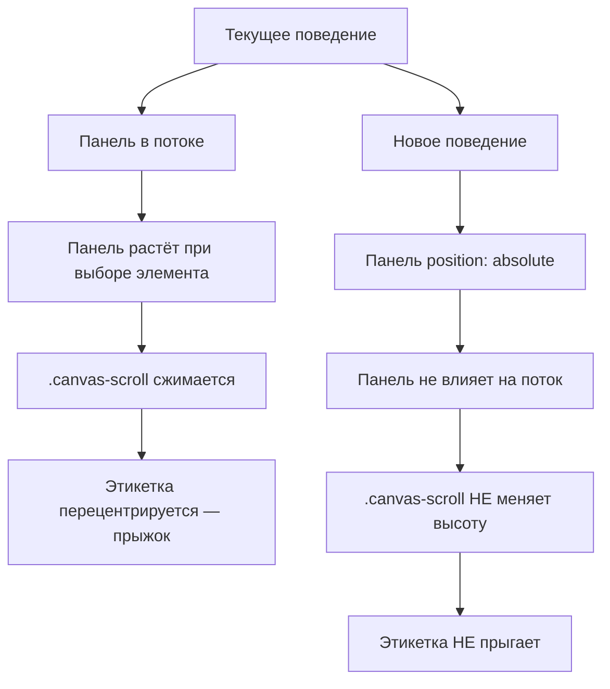

# План: Исправление "прыжка" этикетки при появлении панели свойств элемента

## Проблема

В [`LabelEditor.vue`](../frontend/src/components/LabelEditor.vue:121) верстка рабочей области устроена так:

```
.app-workspace (flex: 1, flex-direction: column)
  │
  ├── ElementPropsPanel    ← в потоке, flex-shrink: 0
  ├── .canvas-scroll       ← flex: 1, overflow: auto
  │     └── LabelCanvas
  └── .print-panel         ← flex-shrink: 0
```

Когда пользователь выбирает элемент на канвасе:

1. В [`ElementPropsPanel.vue`](../frontend/src/components/label-editor/ElementPropsPanel.vue:461) срабатывает `v-if="hasSelection"` и появляется `.rbn-secondary` (второй ряд панели, ~44px высоты).
2. Общая высота `.ribbon-root` увеличивается с ~46px (только `.rbn-type`) до ~90px.
3. Так как панель находится в нормальном потоке, она "отбирает" высоту у `.canvas-scroll` (flex: 1).
4. В [`LabelCanvas.vue`](../frontend/src/components/label-editor/LabelCanvas.vue:262) контейнер `.canvas-container` использует `justify-content: center`, поэтому этикетка перецентрируется при изменении высоты — визуальный "прыжок".

## Решение: абсолютное позиционирование панели (overlay)

Панель свойств элемента должна позиционироваться **поверх** канваса, не влияя на его высоту.



### Изменения

#### 1. [`LabelEditor.vue`](../frontend/src/components/LabelEditor.vue)

**a.** Оборачиваем `ElementPropsPanel` в `<div class="ribbon-wrap">` для удобного селектора:

```diff
- <ElementPropsPanel />
+ <div class="ribbon-wrap">
+   <ElementPropsPanel />
+ </div>
```

**b.** Добавляем стили для `.ribbon-wrap`:

```css
.ribbon-wrap {
  position: absolute;
  top: 0;
  left: 0;
  right: 0;
  z-index: 100;
}
```

**c.** Делаем `.app-workspace` контекстом позиционирования:

```css
.app-workspace {
  position: relative;
  /* остальные стили без изменений */
}
```

**d.** Добавляем `padding-top` на `.canvas-scroll`, равный высоте всегда видимого первого ряда (`.rbn-type` — 46px). Это предотвращает перекрытие канваса панелью в idle-состоянии:

```css
.canvas-scroll {
  padding-top: 46px;
  /* остальные стили без изменений */
}
```

#### 2. [`ElementPropsPanel.vue`](../frontend/src/components/label-editor/ElementPropsPanel.vue)

**a.** Убираем `flex-shrink: 0` из `.ribbon-root` — теперь он не участвует в flex-раскладке родителя.

**b.** Убираем `box-shadow` и `border-bottom` из `.ribbon-root`, т.к. при overlay-позиционировании они будут перекрывать канвас, а не отделять панель от него. Вместо этого добавляем тонкую тень, чтобы создать визуальное отделение от канваса:

```css
.ribbon-root {
  box-shadow: 0 2px 8px rgba(0, 0, 0, 0.15);
}
```

**c.** Для idle-состояния (`ribbon-root--idle`) можно сделать панель полупрозрачной:

```css
.ribbon-root--idle {
  opacity: 0.5;
}
```

### Потенциальные проблемы и их решение

| Проблема                                                      | Решение                                                                                                                                                                      |
| ------------------------------------------------------------- | ---------------------------------------------------------------------------------------------------------------------------------------------------------------------------- |
| **Перекрытие кнопок/интерактивных элементов канваса панелью** | Панель всегда сверху — приемлемо, т.к. пользователь работает с панелью. Если нужно кликнуть на элемент за панелью, достаточно кликнуть вне зоны панели (ниже `padding-top`). |
| **Панель печати (`.print-panel`) может перекрываться**        | `.print-panel` находится внизу с `flex-shrink: 0` и не перекрывается, т.к. панель свойств прижата к верху.                                                                   |
| **Высота `.ribbon-root` может быть больше 46px даже в idle**  | Нет, в idle показывается только `.rbn-type` с `min-height: 46px`, второй ряд скрыт `v-if`.                                                                                   |
| **Resize окна / ресайз канваса**                              | Overlay-панель не зависит от размеров канваса — она привязана к `.app-workspace`. При ресайзе окна ширина панели подстраивается через `left: 0; right: 0;`.                  |
| **Высокий DPI / разные разрешения**                           | `padding-top: 46px` фиксирован и соответствует `min-height` первого ряда панели — не зависит от разрешения.                                                                  |

### Что НЕ меняется

- Логика выбора элемента (стор [`labelEditor.ts`](../frontend/src/stores/labelEditor.ts))
- Логика зума и fitZoom в [`LabelCanvas.vue`](../frontend/src/components/label-editor/LabelCanvas.vue)
- Панель [`AddElementPanel.vue`](../frontend/src/components/label-editor/AddElementPanel.vue) и [`LabelSizePanel.vue`](../frontend/src/components/label-editor/LabelSizePanel.vue) в левом сайдбаре
- Панель [`PrintDataPanel.vue`](../frontend/src/components/label-editor/PrintDataPanel.vue) внизу

### Пошаговый план реализации

1. В [`LabelEditor.vue`](../frontend/src/components/LabelEditor.vue):
   - Обернуть `<ElementPropsPanel />` в `<div class="ribbon-wrap">`
   - Добавить `.ribbon-wrap { position: absolute; top: 0; left: 0; right: 0; z-index: 100; }`
   - Добавить `.app-workspace { position: relative; }`
   - Добавить `.canvas-scroll { padding-top: 46px; }`

2. В [`ElementPropsPanel.vue`](../frontend/src/components/label-editor/ElementPropsPanel.vue):
   - Убрать `flex-shrink: 0` из `.ribbon-root`
   - Заменить `border-bottom` и `box-shadow` на overlay-совместимую тень
   - Настроить idle-состояние на полупрозрачность

3. Проверить визуально:
   - В idle-состоянии панель полупрозрачна, канвас не перекрыт
   - При выборе элемента панель становится непрозрачной, появляется второй ряд
   - Этикетка НЕ прыгает
   - Все контролы панели работают корректно (клики, инпуты, дропдауны)
   - Канвас скроллится под панелью
