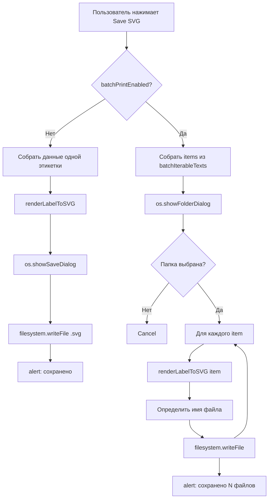

# План: Кнопка "Save SVG" в редакторе этикеток

## Задача

Рядом с кнопкой SVG-рендера в `PrintActionsBar` добавить кнопку "Save SVG". При одиночном режиме — открывает диалог сохранения одного `.svg` файла. При включённой групповой печати — открывает диалог выбора папки и сохраняет каждую этикетку как отдельный `.svg` файл.

## Текущая архитектура (изучено)

### Компоненты

- [`PrintActionsBar.vue`](frontend/src/components/label-editor/PrintActionsBar.vue) — нижняя панель действий, содержит:
  - Индикатор сохранённого файла
  - Кнопка-переключатель `SVG` (`svgRenderEnabled`)
  - Кнопка `Печать` → вызывает `store.printLabels()`

- [`labelEditor.ts`](frontend/src/stores/labelEditor.ts) — Pinia store, содержит:
  - `printLabels()` — логика печати (одиночная / batch)
  - `buildSinglePrintData()`, `buildTemplateData()` — сборка данных для рендеринга
  - `svgRenderEnabled` — флаг SVG-рендера
  - `batchPrintEnabled` — флаг групповой печати
  - `batchIterableTexts` — значения для итерируемых barcode
  - `batchCommonData` — общие данные для всех этикеток
  - `iterableFields` — список dataField итерируемых barcode

### Рендереры

- [`renderToSVG.ts`](frontend/src/assets/renderToSVG.ts) — SVG-рендерер:
  - `renderLabelToSVG(templateData, data, serial?)` — рендерит **одну** этикетку → SVG строка
  - `renderLabelsToHTML(items, common, templateData)` — рендерит **пакет** → HTML-страница с встроенными SVG

- [`htmlRenderer.ts`](frontend/src/assets/htmlRenderer.ts) — HTML-рендерер (не используется для SVG)

### Печать

- [`printLabelMultyСopy.ts`](frontend/src/assets/printLabelMultyСopy.ts) — оркестратор:
  - `printFromTemplateSVG(items, common, templateData)` — вызывает `renderLabelsToHTML()`, пишет `.html` в `.tmp/`, открывает окно браузера для печати

## План реализации

### Шаг 1: Добавить метод `saveSVG()` в store [`labelEditor.ts`](frontend/src/stores/labelEditor.ts)

#### Логика:

```typescript
async function saveSVG(): Promise<void> {
  const td = buildTemplateData();

  if (!batchPrintEnabled.value) {
    // ── Одиночный режим ───────────────────────────────────────────────
    // 1. Собираем данные для одной этикетки (как в buildSinglePrintData)
    const { items, common } = buildSinglePrintData();
    // 2. Рендерим SVG
    const svg = await renderLabelToSVG(td, common, items[0]?.serial ?? "");
    // 3. Диалог сохранения
    const path = await os.showSaveDialog("Сохранить SVG", {
      defaultPath:
        (lastSavedPath.value || "label").replace(/\.[^.]+$/, "") + ".svg",
      filters: [{ name: "SVG файл", extensions: ["svg"] }],
    });
    if (!path) return;
    // 4. Пишем файл
    await filesystem.writeFile(path, svg);
    alert(`SVG сохранён: ${path.split(/[/\\]/).pop()}`);
    return;
  }

  // ── Пакетный режим ──────────────────────────────────────────────────
  // 1. Собираем items как в printLabels (из batchIterableTexts)
  // 2. Запрашиваем папку через os.showFolderDialog()
  // 3. Для каждого item: рендерим SVG → сохраняем
  // 4. Имена: из первого итерируемого поля, или label_1.svg, label_2.svg...
}
```

#### Детали для batch-режима:

1. Сбор итерируемых данных — копируем логику из `printLabels()` (строки 594–644):
   - Проходим по `elements`, собираем `iterableData` из `batchIterableTexts`
   - Валидируем длины
   - Строим `items: BatchItem[]`

2. Диалог выбора папки через Neutralino:
   - Используем `os.showFolderDialog()` (проверить наличие API; если нет — используем `os.showOpenDialog` с `directory` опцией)

3. Для каждого `item` c индексом `i`:
   - Получаем `itemData = { ...batchCommonData, ...item }`
   - Генерируем SVG через `renderLabelToSVG(td, itemData, item.serial ?? '')`
   - Определяем имя файла:
     - Берём значение первого итерируемого поля: `item[firstField] ?? ''`
     - Если значение пустое или содержит недопустимые символы — санитайзим, заменяем недопустимые символы на `_`
     - Если и после санитайзации пусто — используем `label_${i + 1}`
   - Формируем полный путь: `${folderPath}/${fileName}.svg`
   - Пишем файл через `filesystem.writeFile()`

4. Показываем сводку: `alert('Сохранено N SVG файлов в папке ...')`

### Шаг 2: Добавить кнопку в [`PrintActionsBar.vue`](frontend/src/components/label-editor/PrintActionsBar.vue)

Рядом с кнопкой SVG-рендера (после неё, перед разделителем `pa-divider`):

```html
<v-tooltip location="top" text="Сохранить этикетку как SVG">
  <template #activator="{ props: tp }">
    <button v-bind="tp" class="pa-btn" @click="store.saveSVG">
      <v-icon size="13">mdi-file-download-outline</v-icon>
      <span>Save SVG</span>
    </button>
  </template>
</v-tooltip>
```

### Шаг 3: Импорты в store

Добавить импорты:

- `import { renderLabelToSVG } from '@/assets/renderToSVG'`

В `labelEditor.ts` уже импортированы `os` и `filesystem` из `@neutralinojs/lib`.

### Проверка Neutralino API

Проверить наличие `os.showFolderDialog()` в Neutralino. Если нет — искать альтернативу:

- `os.showOpenDialog()` может принимать `{ multiSelections: false, filters: [] }` — но это для файлов.
- Для выбора папки в Neutralino есть `os.showFolderDialog()` (см. [Neutralinojs docs](https://neutralino.js.org/docs/api/os/#osshowfolderdialog)).
- Если API нет — можно использовать `NL_PATH` + инпут с ручным вводом пути.

## Файлы для изменений

| Файл                                                                                                                   | Изменения                                                                     |
| ---------------------------------------------------------------------------------------------------------------------- | ----------------------------------------------------------------------------- |
| [`frontend/src/stores/labelEditor.ts`](frontend/src/stores/labelEditor.ts)                                             | Добавить `import { renderLabelToSVG }`, метод `saveSVG()`, экспортировать его |
| [`frontend/src/components/label-editor/PrintActionsBar.vue`](frontend/src/components/label-editor/PrintActionsBar.vue) | Добавить кнопку "Save SVG" после SVG toggle                                   |

## Схема потока



## Примечания

- Метод `saveSVG()` не зависит от `svgRenderEnabled` — SVG рендеринг используется всегда для сохранения, даже если на канвасе HTML-режим. Это корректно, т.к. `renderToSVG.ts` рендерит в векторный SVG независимо от режима отображения.
- Обработка ошибок: try/catch вокруг `renderLabelToSVG` и `filesystem.writeFile` с `console.error` и `alert`.
- Для batch-режима имена файлов санитайзятся (удаление недопустимых символов файловой системы Windows: `\ / : * ? " < > |`).
